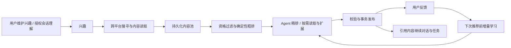
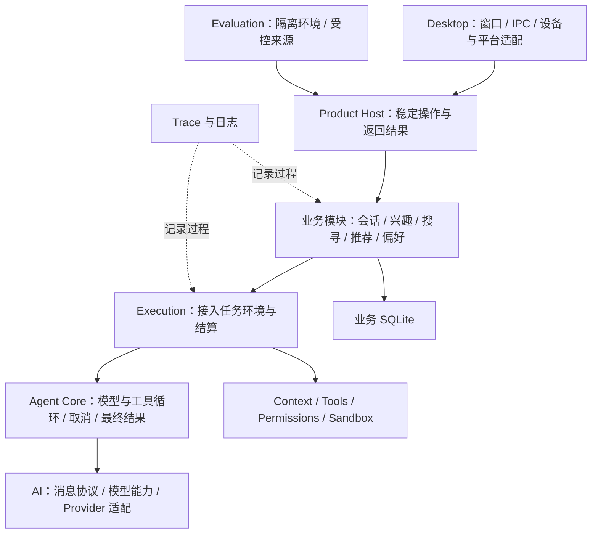

# Megumi 简历与项目面试学习手册（新版）

整理日期：2026-09-06。

本文包含本轮确认的新版简历，以及与五条核心工作对应的项目讲解、实现细节、连续追问和练习。原手册 `megumi-resume-and-interview-guide.md` 保留作为参考，不修改其内容。

简历中的量化结果均为待测占位，不代表已有测量结论；完成对照评测后替换。整理日期不作为项目开发起止时间。

## 一、简历正文

### 项目名称与角色

**Megumi｜跨平台个性化内容推荐 Agent｜独立设计与开发**

开发时间：待填写真实项目起止时间。

### 项目描述

面向个人用户的跨平台个性化内容推荐 Agent，根据用户兴趣主动搜寻、筛选内容，并通过反馈学习持续调整推荐，减少跨平台搜索与筛选成本。支持围绕推荐内容继续提问、分析和执行任务，采用本地优先的桌面架构。

### 技术栈

TypeScript、Node.js、Electron、React、SQLite（better-sqlite3）、Drizzle ORM、Zod / TypeBox、Vitest。

### 核心工作

1. **Agent Harness 架构设计**：设计面向多场景任务的模块化 Agent Harness，构建**多模型接入适配、多模态交互（语音对话、图片与文档输入）、任务驱动的动态工具编排与会话上下文管理**执行体系，适配通用对话、主动搜寻与个性化推荐的差异化执行需求。

2. **主动搜寻与分层推荐**：设计跨平台搜寻与推荐机制（Bilibili、小红书、知乎等），以**持久化内容池解耦搜寻与推荐**，通过**全量确定性粗排、Agent 精排与按需扩展**兼顾成本与内容覆盖，实现单次推荐任务输入 Token 降低 **[待测 X%]**、推荐相关率达到 **[待测 Y%]**。

3. **偏好学习**：为提升推荐内容与用户兴趣的契合程度，设计**融合反馈证据与历史偏好的增量学习机制**，通过偏好归并、修订与失效管理持续更新用户偏好，并以用户修正约束自动学习结果，持续优化推荐依据，使推荐相关性 **NDCG@K 提升 [X%]**。

4. **长任务与安全执行**：设计面向长任务的可靠执行与安全控制机制，通过**分层压缩与溢出恢复机制维护任务上下文**，结合**权限审批、Windows 沙箱及工具并发调度与重试**，实现长任务持续推进、工具操作受控及异常情况下的有序终止。

5. **全链路观测与质量评估**：构建覆盖核心业务的 **Trace 与日志观测系统**，设计**执行隔离、评分解耦的自动化评估机制**，结合**多维度自动评分与人工语义评审**，量化任务质量与执行成本，实现逐样本退化识别与执行问题追溯。

## 二、使用方法与项目主线

本次实现核对基准：`4412e447`，2026-09-06。以下以当前代码、测试和相关有效文档为依据；旧手册只提供问题组织参考。本文是个人学习资料，不替代 `docs/current/` 或 Spec。

每题的“面试回答”用于练习口头表达；“实现展开”帮助理解依据；追问用于检查是否真正掌握。可以按自己的说话习惯调整回答，但不要把讲解示例说成真实用户数据。文中的实现取舍解释是对当前设计的分析，不等于开发者当时实际经历过的心路历程。

推荐阅读顺序：先掌握本章整体主线，再学习第三至七章的五项核心工作，最后练习跨模块场景、指标和项目复盘。面试时先回答对方正在问的问题，只有继续追问时才展开表结构、版本字段和异常路径。

| 学习重点 | 位置 | 建议练习方式 |
| --- | --- | --- |
| 讲清产品和整体架构 | 第二章 | 练习一分钟介绍，画出两张图 |
| Harness、多模型、多模态与工具 | 第三章，Q01–Q08 | 从一次 ModelCall 解释上下文和工具怎样接入 |
| 搜寻、内容池、粗排、精排和发布 | 第四章，Q09–Q16 | 手算排序并追踪一条内容的完整生命周期 |
| 偏好学习、三张表、版本和用户管理 | 第五章，Q17–Q27 | 模拟反馈反转、用户编辑与删除 |
| 压缩、长任务、沙箱、并发和取消 | 第六章，Q28–Q36 | 画出压缩边界和取消传播路径 |
| Trace、自动化评估与对照 | 第七章，Q37–Q45 | 对着一份真实记录解释每类证据 |
| 简历中的量化指标 | 第八章，Q46–Q48 | 手算 NDCG，说明实验条件和数据边界 |
| 后端选型、运行时校验与测试 | 第九章，Q49–Q52 | 从具体业务解释数据库和接口设计 |
| 场景推演、项目复盘与代码练习 | 第十至十二章 | 脱离文档接受连续追问 |

### 2.1 一分钟项目介绍

> Megumi 是一个面向个人用户的跨平台个性化内容推荐 Agent，解决的是用户需要在多个平台反复搜索、筛选感兴趣内容的问题。它根据用户维护或授权理解的兴趣搜寻内容，先保存可复用的内容材料，再结合兴趣、历史推荐和反馈完成推荐。用户也能围绕这些内容继续提问、分析和执行任务。
>
> 工程上，我设计了支撑通用对话、搜寻和推荐三类任务的 Agent Harness，处理模型适配、上下文、工具和安全执行。业务上，重点是分层推荐如何兼顾成本与覆盖，以及如何把反馈转为可更新、可纠正的偏好。观测和评估则用来检查执行是否正确、推荐为什么出现偏差，以及修改策略后有没有退化。

介绍时选择两项自己最熟悉的设计继续展开，不必把简历五条逐字复述。对方问产品就先讲使用场景，问工程就从执行边界或业务一致性展开。

### 2.2 三分钟展开：一条内容如何到达用户

以“用户关注摄影，希望找到实操内容”为讲解例子：用户维护兴趣，或授权系统从长期会话中理解兴趣；搜寻阶段访问来源、读取内容并保存可用材料；推荐阶段从这些材料中筛选、粗排，再让 Agent 决定最终顺序和推荐理由。发布后保存独立内容快照，用户点赞、点踩形成反馈。下次真正生成推荐前，系统按需学习偏好，再使用更新后的有效输入。

这里有三个关键区分：兴趣说明关注什么；内容池保存找到的事实；推荐说明本次选择什么。偏好则帮助推荐理解用户在同一兴趣下更喜欢的内容特征。它们不是一个模型调用的不同返回字段，而是具有各自输入、状态和约束的业务能力。



这张图表达业务数据关系，不表示一次同步调用必须从头走到尾。搜寻和推荐各自调度，通过持久化内容衔接；反馈写入本身不会立即调用学习模型。

### 2.3 整体架构怎样画



Harness 是 AI、Agent Core 之外的产品运行环境和支撑模块的统称，不是图中缺失的一个“总管对象”。兴趣提取与偏好学习是给定材料到结构化结果的模型调用，不强行经过带工具的 Agent Loop。图中的箭头表达主要协作关系，不能据此认为所有调用都必须逐层转发。

### 2.4 面试前先记住这些身份的区别

| 名称 | 标识什么 | 典型误解 |
| --- | --- | --- |
| Session | 可持续交互的会话 | 一次模型调用 |
| Entry / Message | 历史树节点 / 消息内容事实 | 一个 ID 同时承担分支与内容身份 |
| Execution | 一次 Agent 执行 | 一定对应整项长期业务 |
| ModelCall / attempt | 一次逻辑模型调用 / 实际尝试 | 重试就是新业务任务 |
| requestId | 推荐等业务的一次请求关联 | 推荐内容主键 |
| Candidate | 已获取的可用内容事实 | 已向用户推荐的内容 |
| Recommendation | 正式发布的推荐决策 | 模型输出的一句话 |
| Trace | 执行诊断证据 | 数据库业务事实的替代品 |

阅读入口：[当前运行链路](current/runtime-flows.md)、[系统结构](current/system-map.md)、[总体架构](architecture/v3/overall-architecture.md)。

## 三、Agent Harness 架构设计

### Q01：你的 Harness 具体设计了什么？

**面试回答：** Harness 负责为模型执行提供完整的产品环境：组织任务指令和上下文、装配可用工具、连接权限与沙箱，并将执行结果转成正式业务事实。我把模型协议差异放在 AI 层，把模型—工具循环放在 Agent Core，业务模块通过 Execution 接入这套核心，使对话、搜寻和推荐各自保留不同的输入、工具和完成条件。

**实现展开：** `composeApplication` 装配业务能力与宿主接口；`createContextAdapter` 在模型调用前准备工具作用域和上下文；工具 Adapter 将调用接到具体操作；Execution 关联执行与会话或后台业务。关键不是创建一个名叫 Harness 的类，而是明确谁可以修改什么状态。Agent Core 可以结束执行，但不能绕过推荐模块直接写推荐表。

**追问：为什么不把这些全写进循环？** 循环一旦知道推荐表、会话树、Electron 窗口和来源登录，就会因任一业务变化而修改，测试也依赖完整桌面环境。当前边界让核心只处理执行语义，代价是需要维护上下文、工具和结算接口。它不是越多层越好，接口必须服务于真实差异。

**继续追问：项目是不是三个 Agent？** 不是。三个场景属于同一产品的不同任务，AI、Agent Core、Harness 也是职责划分，并非多个自主协作 Agent。

### Q02：三个任务场景到底有什么差异？

**面试回答：** 对话围绕会话历史和工作区执行用户任务；搜寻围绕兴趣和内容缺口访问来源、提交内容；推荐围绕已获取材料、偏好与历史作最终选择。相同的是模型与工具交互方式，不同的是可见材料、允许操作和业务完成条件。

| 场景 | 主要上下文 | 典型工具 | 完成事实 |
| --- | --- | --- | --- |
| 通用对话 | 当前分支、输入附件、工作区、指令和 Skill | 文件、命令及获准网络工具等 | 执行结算并保存会话回复；具体任务还需检查产物 |
| 主动搜寻 | 有效兴趣、池缺口、来源能力、本次读取材料 | `search_content`、`read_source_candidate`、`submit_candidates` | 合法内容及兴趣关联写入；是否补足由供给业务判断 |
| 个性化推荐 | 内容快照、粗排工作集、兴趣、偏好、历史 | `read_recommendation_candidate`、`expand_recommendation_working_set`、`publish_recommendations` | 推荐通过校验并事务发布 |

**追问：为什么推荐不自己搜索？** 推荐要基于本次稳定材料完成选择；把外部搜索也放进来，会重新混合供给覆盖、来源故障和最终选择。当前通过扩大工作集读取同一快照中的更多内容，而不是临时接管搜寻职责。

### Q03：多模型适配是不是只换 API 地址？

**面试回答：** 不只是地址。不同协议的消息结构、流式事件、工具调用、结束原因和用量表达都有差异。AI 层用统一的模型与消息 Contract 描述调用，再由具体 Adapter 完成协议转换，执行核心消费统一结果。

**实现展开：** 内部消息区分用户消息、Assistant 文本/思考/工具调用块和工具结果；工具结果关联 `toolCallId`。Model 描述 API 类型、上下文容量、支持的输入及配置能力。`runModelCall` 处理流式尝试、终态、可恢复错误及上下文溢出；Provider 接入处理具体协议。模型返回工具调用仍要由实际工具系统校验执行。

**追问：统一之后能力一样吗？** 不一样。模型不支持图片时，统一消息类型不能凭空补齐视觉能力；工具调用质量、上下文限制和推理选项也仍有差别。接入成功需要协议测试，适合业务还需要质量评估。这是两个判断。

**追问：切模型需要改哪些地方？** 在已有 API 协议内，通常是模型配置与能力声明；新增协议要实现协议 Adapter 并验证流式、错误和工具消息语义，业务排序和数据库不应随之重写。

### Q04：任务驱动的动态工具编排，代码中具体是什么？

**面试回答：** 先按任务限制工具集合，再为每次模型调用建立固定的工具定义与路由绑定，让模型只能在当前任务允许的范围内选择工具。模型负责选择调用顺序，工程侧负责参数校验、权限、调度和结果回传。

**实现展开：** `Tools.bindExecution` 绑定 `executionId`、执行主体和 `toolGroupId`；对话必须具有 Session 与 Workspace。`prepareModelCall` 再产生 `ModelCallToolBinding`，里面包含本轮 `definitions`、路由和执行入口。Context 将这组定义交给模型，工具调用也通过这一个绑定路由，避免“给模型看的工具”和“实际调用的工具”不一致。调用结束后 `close()` 释放作用域，关闭后不能再使用旧路由。

**追问：动态是不是模型临时生成工具代码？** 当前不是。动态体现在任务、配置、能力可用性和调用作用域决定暴露范围，以及模型在范围内选择行动。工具实现来自注册系统，模型不能通过编造名称获得新权限。

**追问：为什么不能全量暴露？** 不相关工具增加选择负担，也容易混淆业务职责。推荐任务没有理由拥有工作区任意写文件能力；限制可见工具和执行权限要同时做，仅从提示词里说“不要用”不够。

### Q05：多模态输入如何进入同一套执行体系？

**面试回答：** 多模态交互共享会话和任务执行，但不同材料采用合适的输入方式：语音识别形成文本输入，图片保留为模型能识别的图片内容，文档保存附件引用并在需要时读取解析。输入层负责格式、数量、大小和引用有效性，不把所有材料无条件塞进一段文本。

**实现展开：** 图片支持 PNG、JPEG、WebP，Context 根据 `model.input.includes('image')` 判断模型能力。文档入口支持 PDF、DOCX、TXT 和 Markdown；`processDocumentInput` 校验引用、大小和类型，本身不读完整正文。这样接纳附件与读取正文是不同阶段，避免上传文档立即消耗全部上下文。后续工具读取仍受文件与输出范围约束。

语音输入由采集、活动检测、语句切分和识别组成，再接入普通输入链路；当前还存在回复朗读链路。`onRunEndedForSpeechOutput` 在成功执行后读取已结算的 Assistant Reply，检查朗读开关和 TTS 配置，再提交合成；取消执行会请求停止朗读。不能继续沿用旧手册“尚无 TTS”的说法。

**追问：这是端到端原生音频大模型吗？** 当前这些代码体现的是语音识别、Agent 文本执行和独立语音输出的组合。用户体验可以是语音交互，工程实现不等于一条原生音频推理流。

### Q06：上下文是不是拼接一个大 Prompt？

**面试回答：** 拼接只是最后的表达形式，核心是决定本次模型调用能看到哪些事实、哪些约束和哪些工具。不同任务的 Resolver 读取各自权威数据，Prompt Builder 再把指令、消息和工具定义组装为模型输入。

**实现展开：** 对话 Resolver 读取当前会话分支、系统与工作区指令、Skill、运行环境和附件能力；推荐 Resolver 读取本次业务快照；学习 Resolver 读取捕获的反馈和偏好范围。ModelCall 前准备输入，Provider 再做最终协议转换。排查问题时既要看材料准备，也要看真正发送给 Provider 的内容，不能只打开指令 Markdown 就认为掌握了全部输入。

**追问：正文里写着“忽略之前指令”怎么办？** 来源正文属于待分析数据，不是用户授权。上下文组织要区分指令与材料，工具和业务提交仍执行权限与规则校验。这个分工减少越权机会，但不能声称模型永远不会受恶意正文影响。

### Q07：Skill、Tool 与 Prompt 有什么区别？

**面试回答：** Prompt 是本次给模型的指令和材料表达；Skill 提供某类任务的方法与资源；Tool 是能被真实执行的操作。Skill 可以指导模型怎样使用工具，但不能绕过工具本身的权限和参数约束。

**实现展开：** Context 读取可用 Skill 视图和相关指令，Tools 注册可执行能力。加载一份 Skill 不意味着安装了新的系统执行权限，也不是改变模型参数。解释时用“方法说明”和“实际操作入口”区分，比说“都是插件”清楚。

**追问：Skill 为什么不全部展开？** 要区分发现可用方法和加载完整材料，避免不相关说明占满上下文。具体选择与加载行为需要结合 `skills` 和 Prompt 构造代码讲，不能把设计目标说成模型每次必然正确选择。

### Q08：为什么自研执行体系？为什么不用现成框架？

**面试回答：** 这个项目需要精确控制模型调用、工具权限、审批等待、取消和业务结算，也需要同一业务在桌面和评估环境执行。因此我将这些边界做成可注入、可单独测试的接口。选择自研的重点是匹配这些产品语义，而不是认为现成框架普遍不好。

**实现展开：** Desktop 与 Evaluation 调用同一个 `composeApplication`，由宿主提供平台和外部适配器；核心测试可以注入模型流和工具，不启动 Electron。收益是能够检查具体边界，成本是需要维护协议兼容、取消收尾和错误分类。

**追问：怎么证明不是 API 套壳？** 挑一条模型本身不能保证的产品规则讲清楚，例如用户修改偏好后旧推荐不能提交、取消后不能用迟到结果继续动作。再指出负责它的代码与测试。模型负责语义判断，工程负责操作与事实的可靠落地，两者都不可缺。

**追问：代码都是自己从零写的吗？** 独立开发指承担需求、设计、实现和验证责任，不意味着从零实现 SDK、数据库、Electron 或参考过的基础执行模式。涉及代码来源应按实际文件和历史说明，不预设“全部原创”。

本章代码入口：[应用装配](../packages/agent/composition/src/compose-application.ts)、[Context Adapter](../packages/agent/execution/src/context-adapter.ts)、[工具作用域](../packages/agent/tools/src/tools.ts)、[模型调用](../packages/agent-core/src/model-call.ts)、[统一消息类型](../packages/ai/src/types.ts)、[附件策略](../packages/agent/input/src/input-policy.ts)、[文档接纳](../packages/agent/input/src/document-input.ts)、[语音输出接线](../packages/agent/voice/src/speech-output/speech-output-wiring.ts)。对应测试：[输入附件](../tests/packages/input/input-attachment-policy.test.ts)、[工具批次](../tests/packages/agent-core/tool-call.test.ts)、[语音输出](../tests/packages/voice/speech-output/speech-output-wiring.test.ts)。

## 四、主动搜寻与分层推荐

### Q09：为什么把搜寻和推荐拆开？直接搜完推荐不行吗？

**面试回答：** 搜寻解决有没有足够可用内容，推荐解决当前应该把哪些内容交给用户。将获取的内容持久化后，后续推荐可以复用材料，也能分别定位来源获取问题和推荐判断问题。

**实现展开：** 供给阶段保存 Candidate、内容摘要/摘录和兴趣关联，不提前写最终推荐理由。推荐独立读取当前有效内容池，经过过滤、粗排、Agent 精排和发布。Pool 是查询结果，不是单独一张“池表”。一个内容可以关联多个兴趣，所以关联关系独立保存等级和依据。

**追问：这样增加了什么复杂度？** 内容会过期、兴趣会变化、内容池有容量，还要处理等待和消费。持久化不是免费收益，必须说明有效内容的判定和何时补充。对只做一次查询的小功能，现场搜完返回可能更简单；这里存在跨次复用和持续推荐的需要。

### Q10：内容不够时何时补充？为什么有三个数量？

**面试回答：** 最小数量是启动条件，目标数量是本次希望补到的水平，最大数量是容量约束。区分这三者可以避免刚达到最低数量就停、随后立刻又启动的反复补充。

**实现展开：** Runtime 检查有效兴趣、首次供给确认、模型和来源条件，内容数低于 `minimumCount` 才开始补充；目标由 `floor(maximumCount × 0.8)` 推导，每次提交重新核对剩余容量。同一供给 Runtime 只允许一个执行，重复检查不再启动另一个模型任务。

**例子：** 假设最小值 100、最大值 200，目标为 160。现有 99 条会触发，补到 101 条不表示本次必须停止；现有 120 条不会仅因少于 160 就启动。这里的数值用于解释条件关系，实际配置应在 Settings 中查看。

**追问：模型搜不到足够内容怎么办？** 可用来源不保证一定提供足量合适内容。业务需要表达未补足和失败，核心限制约束本次调用次数及工具使用。不能无限搜索，也不能靠伪造材料凑数量。

### Q11：跨平台适配到底统一了什么？

**面试回答：** 统一来源能力、搜索结果和内容事实，平台的登录状态、页面结构、请求和解析差异保留在具体适配器。业务侧面向稳定接口，不在推荐逻辑中判断每个平台的页面结构。

**实现展开：** 当前业务接入 Bilibili、小红书、知乎、抖音及开放网页。搜寻通过 SourceRegistry 路由，先搜索，再读取内容材料，最后提交。不能把搜索摘要、平台返回的正文摘录和完整原文混为一谈；材料中的截断标记应影响模型解释的确定性。

**追问：搜索为空是不是平台没内容？** 需要区分真实空结果、未登录、验证码或风控、页面未加载完成和解析失效。检查来源调用、认证状态、原始材料和解析错误，再判断。受控评估固定了来源材料，只能验证业务对材料的处理，不能证明真实平台当前可用。

### Q12：怎样去重、保存内容和处理过期？

**面试回答：** 按规范化的内容身份去重，保存推荐需要的内容事实与有效期；推荐再根据快照时刻过滤资格。发布时保存内容快照，避免后续内容池变化影响已展示的推荐。

**实现展开：** `contentIdentity` 对规范化 canonical URL 做 SHA-256；规范化处理 fragment、已知追踪参数和参数顺序等差异。相同 URL 的不同追踪入口可以合并，不同网站转载同一正文并不会因此自动合并。兴趣关联和 Candidate 状态、过期时间一起决定池中是否有效。

**追问：为什么推荐再保存一份内容？** Candidate 服务于待推荐材料，RecommendationContent 服务于已发布结果及后续反馈解释。用户是对当时看到的材料作反馈，不能在学习时任意用后来变化的网页替换它。保存的是业务需要的发布快照，不等于抓取完整互联网历史版本。

### Q13：确定性粗排具体怎么算？

**面试回答：** 当前使用有明确优先级的排序规则，先保证兴趣关联程度，再兼顾本次和历史中的兴趣、来源与内容类型覆盖，最后以时间和稳定身份决胜。每选出一条都会更新覆盖计数，因此后面的选择会考虑已经选了什么。

**实现展开：** `rankRecommendationCandidates` 先过滤不合格内容，再对全部有效内容循环选择。比较顺序为：

1. 关联等级：`direct`、`adjacent`、`exploration`。
2. 本次主兴趣计数、近期历史兴趣曝光计数。
3. 本次来源计数、近期历史来源计数。
4. 本次内容类型计数、近期历史内容类型计数。
5. 发布时间、创建时间、稳定 ID。

当前覆盖历史使用 30 天窗口，已推荐身份的去重使用传入的完整历史。候选存在多个兴趣时，先按关联等级、历史曝光和 ID 选择主兴趣。自然语言偏好不直接进入这个比较器，交给后续模型判断。

**手算例子：** A、B 都与摄影直接相关，C 与烹饪直接相关；初始条件相同时 A 先被选中，摄影计数加一，C 可能在下一步优于 B。若 C 只是 adjacent，而 B 是 direct，关联等级仍先决定顺序，不能靠覆盖计数反超。

**追问：是不是多特征加权打分？** 不是。前一项区分出先后，后一项不能补分反超。好处是可解释、可重现；代价是固定优先级可能压制探索，需要评估实际效果。

**追问：复杂度如何？** 当前每轮重新排序剩余内容，比较过程中还统计历史，不应称整体为 O(n log n)。面对规模增长，首先可以预聚合历史计数并测量瓶颈，再讨论选择算法；这属于优化方向，不能当成已有性能成果。

### Q14：为什么是全量粗排加工作集？Agent 怎样扩展？

**面试回答：** 代码先比较全部有效材料，模型先看其中一个工作集，需要更多选择时按需扩展。这样减少一次性输入量，又保留进一步查看其他内容的能力。

**实现展开：** 粗排返回 `rankedCandidates`、`initialWorkingSet`、排除原因以及实际目标数。`actualTargetCount` 是配置目标与有效数量的较小值。初始工作集是完整排序结果的前一段；扩展工具从同一次快照的剩余排序中增加可见材料，读取工具取得已经保存的详细内容。最终发布只允许使用本次已经暴露给 Agent 的合法 ID。

**追问：工作集之外有更好内容怎么办？** 扩展提供机会，但不保证 Agent 必然扩展，也不保证粗排不会遗漏。评估需要分别检查初始暴露、扩展后暴露和最终选择。只看最终内容差，无法判断是粗排挡住了好内容，还是模型看到了却没选。

**追问：Token 一定下降吗？** 不一定。扩展和多轮正文读取也有成本，所以应统计完整推荐任务的输入用量，并在相同材料与目标下比较。简历中的降幅仍是待测占位。

### Q15：Agent 怎样完成精排？为什么发布还要代码校验？

**面试回答：** Agent 结合兴趣、偏好、历史和内容语义选择、排序并解释推荐；代码校验身份、数量、可见范围和可消费性，再把结果原子发布。模型判断与正式写入有明确边界。

**实现展开：** 发布同时写入 Recommendation 决策、RecommendationContent 快照和 RecommendationState 初始状态，并把 Candidate 标记为 consumed。任一步失败整个事务回滚，避免页面只看到部分发布。日内位置从 0 开始且连续，`(local_date, position)` 唯一约束参与防止同一天重复发布。

**追问：快照合法为何还可能不能提交？** 另一次动作可能已经消费内容，或者用户在执行期间修改了影响推荐的要求。快照保证判断材料一致，不等于永久写入许可。发布事务仍检查重复、消费状态和当前偏好保护版本。

**注意新旧规则：** 早期推荐 Spec 将快照后变化统一留给下次执行；后续偏好接入增加了用户更正检查。现在要按接入 Spec 和发布代码解释，不能沿用“执行中的一切变化都不影响本次发布”的旧答案。

### Q16：内容池为空怎么办？为什么不用搜寻成功事件启动推荐？

**面试回答：** 推荐拥有自己的等待和复查，读取持久化内容池判断条件是否满足。供给只负责补内容，不负责宣告推荐应当开始。

**实现展开：** 无内容时不发起空输入的推荐模型调用，而是进入等待，由单个定时器重新检查。后续进入执行、跨日、已有正式发布或出现不能继续等待的错误时退出等待。内存保存定时器和本次请求状态，重启根据业务事实重新判断，而不是恢复旧 Promise。

**追问：事件通知不是更实时吗？** 是可以降低检查延迟，但不能把一次可能遗漏的事件当作唯一正确性来源。当前方案选择独立复查，代价是等待间隔。未来可以让事件加速检查，同时仍以数据库事实为准；这不是本次已实现的事件方案。

本章入口：[粗排实现](../packages/agent/discovery/src/recommendation/recommendation-ranking.ts)、[粗排测试](../tests/packages/discovery/recommendation-ranking.test.ts)、[推荐 Runtime](../packages/agent/discovery/src/recommendation/recommendation-runtime.ts)、[发布 Repository](../packages/agent/discovery/src/persistence/recommendation-repository.ts)、[内容身份](../packages/agent/discovery/src/candidate-supply/content-identity.ts)、[供给 Runtime](../packages/agent/discovery/src/candidate-supply/candidate-supply-runtime.ts)、[推荐 Spec](develop/recommendation/specs/recommendation-spec.md)、[偏好接入 Spec](develop/preference-learning/specs/recommendation-preference-integration-spec.md)。

## 五、偏好学习

### Q17：为什么已经有兴趣，还需要偏好学习？

**面试回答：** 兴趣说明用户关注的领域，但同一领域的内容不一定都适合他。偏好学习从推荐反馈中理解更具体的倾向，使推荐在主题相关的基础上继续调整，而不要求用户把所有需求都提前写进兴趣描述。

**例子：** 用户关注摄影，喜欢“用现有相机完成夜景练习”的教程，不喜欢“最新器材导购”。不能把点踩理解为不再喜欢摄影，也不能凭一次反馈就断定永远排斥器材。学习应结合材料及更多证据提出有范围的判断，后续允许修订。

**追问：兴趣和偏好是不是两个要用户维护的画像？** 不是两个独立产品入口。用户在兴趣管理中查看关联的学习结果，必要时修正或删除。兴趣管理领域，偏好帮助解释该领域内的倾向；用户可以管理自动理解，但不必手动逐条创建所有推断。

### Q18：这里的学习究竟是什么算法？训练模型了吗？

**面试回答：** 这是模型基于反馈证据进行结构化增量推断，学习结果持久化为偏好与证据，作为后续推荐上下文。没有修改模型参数，不是微调、强化学习或协同过滤训练。

**实现展开：** Context 提供作用域、兴趣、用户要求、当前偏好、反馈版本和对应内容。模型通过 `completeSimple` 返回 `add`、`update`、`retire` 变更，Repository 验证后提交。模型负责归纳与修订语义，代码负责身份、依据来源、版本、写入权限和事务完整性。

**追问：简历里的归并是不是聚类算法？** 当前没有独立的向量聚类或自动 merge 算子。归并是模型发现重叠判断后，用 update 保留合适条目、必要时 retire 其他条目表达结果。必须区分业务表达和实际 API，不能声称实现了未经核对的聚类算法。

**追问：和直接把反馈交给推荐模型有什么区别？** 持久化偏好压缩了重复理解的结果，提供稳定身份、证据与用户修正入口；同时也可能固化错误推断。因此既要增量修订和失效处理，也要比较它相对原始反馈是否真的增加推荐价值。

### Q19：为什么在推荐前学习，而不是每次反馈后立即学习？

**面试回答：** 学习结果用于后续推荐，因此在确有推荐需求时更新，可以合并这段时间的反馈变化，减少用户连续操作引发的重复模型调用。用户操作即时保存，旧结论是否仍可用也即时处理，不等待学习结束才生效。

**实现展开：** 唯一正式准备入口是 `preparePreferencesForRecommendation`。应用启动、打开页面、反馈通知和时间推进都不单独启动学习；推荐准入后才检查是否有未处理输入。同一作用域 `revision` 与 `processedRevision` 相等时直接返回，不再次调用模型。

**追问：这会不会让反馈很久不生效？** 要区分保护和推断。用户修改要求、删除偏好或撤回依据，对有效性和发布保护立即生效；需要模型得出的新结论留到下次推荐前。代价是这次推荐可能需要等待学习准备，所以设置总时限并支持降级。

### Q20：模型每次看到哪些材料？为什么不只看新增反馈？

**面试回答：** 输入结合全部未处理反馈、最近的历史反馈以及既有偏好的直接依据。这样新反馈有上下文，旧判断也能复核，不会把一个孤立点赞直接解释成永久偏好。

**实现展开：** 当前默认选择相关作用域内全部未处理反馈、最近 30 条有明确 reaction 的历史反馈，以及偏好引用的直接内容依据，按推荐身份去重。材料同时包含当前与已处理反馈版本、兴趣关联、内容摘要/摘录及完整性标记。最近 30 条是普通历史窗口，不会覆盖掉未处理变化和必须复核的直接依据。

**追问：上次反馈不足，已经标记处理过，下次不就丢了吗？** `processedRevision` 表示本轮已处理，不等于删除原反馈。新反馈出现后，最近历史和直接依据仍会进入新的输入。现有懒学习测试用第一次 `insufficient`、第二次增加反馈的方式检查旧材料仍被带入。

**追问：材料过大怎么办？** Runtime 根据输入预算按独立复核目标分组，每组保留用户要求和删除边界。分组提案合并后再提交对应范围，不能截掉约束，也不能某一组失败却把整个范围标成处理完成。当前默认输入上限还受模型容量和保留输出空间约束。

### Q21：为什么三张表？每张的 ID 和价值是什么？

**面试回答：** Preference 保存判断，Evidence 保存判断依据，PreferenceSet 保存该兴趣范围的处理进度和并发版本。即使没有形成任何偏好，也需要知道哪些输入已处理、用户是否改变了要求，因此集合不能只靠偏好行推导。

| 实体 / 表 | 独立主键 | 关键字段 | 业务意义 |
| --- | --- | --- | --- |
| PreferenceSet / `discovery_preference_sets` | `id`，TEXT UUID | scope、interest_id、revision、processed_revision、policy_revision | 一个兴趣或 exploration 范围的状态与版本边界 |
| Preference / `discovery_preferences` | `id`，TEXT UUID | preference_set_id、origin、statement、revision、status | 一条可修订、有身份的偏好或用户要求 |
| PreferenceEvidence / `discovery_preference_evidence` | `id`，TEXT UUID | preference_id、recommendation_id、reaction_revision、relation | 哪一版反馈和什么内容支持或反驳判断 |

Set 的 `interest_id` 在非空时唯一，exploration 由部分唯一索引限制为一个作用域；Evidence 的 `(preference_id, recommendation_id)` 唯一，支持同一偏好关联多个反馈，也支持同一反馈参与多个偏好。正文读取 RecommendationContent，不再复制完整正文到 Evidence。

**追问：为什么不加学习任务表和纠正事件表？** 当前只需要保留偏好事实、依据、处理水位与删除边界。执行批次、分组和请求快照是临时工作对象，Trace 承担诊断。没有确认独立恢复或查询需求时，再加持久任务实体会增加维护成本。

### Q22：这些版本字段分别保护什么？

**面试回答：** 学习提交要确认自己依据的反馈和旧偏好还有效，推荐发布要确认用户没有改变当前要求。这两类保护相关，但不能用一个版本号混在一起。

| 字段 | 用途 | 为什么需要 |
| --- | --- | --- |
| `reactionRevision` | 某条反馈的当前版本 | 点赞改点踩后旧证据不能继续当成当前反馈 |
| `learnedReactionRevision` | 已确认处理的反馈版本 | 失败后仍能发现待处理变化；不等于必须生成偏好 |
| Set `revision` / `processedRevision` | 作用域事实版本 / 已处理版本 | 识别待学习输入，校验模型提案的基准 |
| Preference `revision` | 单条偏好版本 | 用户编辑或模型更新需要检查目标是否已改变 |
| Set `policyRevision` | 需要拦截旧推荐的更正版本 | 区分普通首次反馈与用户更正，避免每次点赞都打断推荐 |

**实现展开：** 模型调用在数据库事务外进行。提交时检查捕获反馈的当前与已处理版本、作用域 `baseRevision`、目标偏好 revision、有效兴趣和依据。所有检查通过后才修改偏好及证据，并推进处理水位。跨作用域共享的反馈还要等相关范围处理完成，不能因为处理了一个兴趣就把其他范围遗漏。

**追问：单机还会有并发冲突？** JavaScript 单线程不等于没有异步交错。模型请求等待期间用户操作可以提交，模型回来时读取基准已旧。SQLite 事务保护短时间写入，版本校验保护跨越外部等待的业务判断。

### Q23：新增、修订和撤销如何提交？模型能随意覆盖吗？

**面试回答：** 模型提交明确的增量提案，只修改被列出的自动偏好。新增分配新 ID，修订保留原 ID，撤销改为 retired；未提到的有效条目保留，用户条目不能由模型修改。

**实现展开：** Repository 在任何写入前检查作用域覆盖、目标身份、重复修改、expectedRevision 和依据。新增/修订至少要有一个 support，引用的反馈必须属于允许材料及正确作用域，版本和 reaction 必须一致；提供 `contentQuote` 时还要在本次摘要、描述或正文中找到原样片段。

`reviewedPreferenceIds` 必须覆盖需要复核的自动条目，处于 needs_review 的条目必须得到明确处理，不能只返回“没有变化”就恢复有效。更新时以本次依据替换该条目的依据关系，但通过唯一键保留已有关系身份。

**追问：引用原文存在，就能证明推断正确吗？** 不能。代码只能证明来源与版本合法、引文存在；从这段内容推导出的偏好是否恰当仍是语义问题。把“步骤对照”推断为“有测量数据”就可能超出证据，需要语义评审发现。

### Q24：用户改了自动偏好，后面会被模型改回去吗？

**面试回答：** 用户编辑后的条目保留原 ID，但转为 `origin=user`，作为明确要求使用。自动学习不能修改或撤销它，原来引用的反馈即使失效，也不能撤销用户现在的表达。

**实现展开：** 编辑接口检查 `expectedRevision`，将 statement 更新、status 设为 active、记录 `userEditedAt`，清空自动推断的 polarity 和 dimension。因为用户原话可能同时包含偏好与例外，不能套用修改前模型的单一分类。同一作用域其他自动判断进入待核验，并推进更正版本。

**例子：** 自动偏好是“不看器材介绍”，用户修改为“优先实操，但重要器材评测也可以”。它已经是一条明确要求，不再依赖当初点赞是否存在。旧证据仍可供查看最初学习来源，但不能证明用户新句子的全部含义。

**追问：提示词写用户优先就够了吗？** 不够。模型输出校验直接拒绝对 user 条目的自动 update/retire；推荐输入也保留用户要求。提示词表达优先级，写入边界保证不能覆盖。

### Q25：删除后为什么还留记录？还能重新学出来吗？

**面试回答：** 删除立即让该偏好不再参与推荐，但保留最小删除边界，防止系统拿同一批旧反馈又生成同一个判断。后续出现新的相关支持时，可以形成一个新偏好，使用新 ID，而不是恢复被用户删除的条目。

**实现展开：** 删除记录 `deletedAt` 和 `deletedFeedbackSequence`，后者是删除时反馈序号上界。相同判断的新增必须包含序号更大的支持。使用序号而非时间，是为了避免同毫秒操作和时钟变化造成先后顺序不清。当前接口没有撤销删除操作，删除不等于删除原始推荐反馈。

**追问：把原句换个说法就能绕过吗？** 确定性校验覆盖归一化文本相同、显式关联删除 ID 和证据序号；语义同义判断仍依赖模型遵守删除边界，不能说数据库解决了所有同义重建。需要反例样本检查这类漏洞。

**追问：删除“不喜欢导购”是不是今后必须推荐导购？** 不是。删除撤销的是系统结论，不自动产生相反偏好。后续仍依据有效兴趣、其他要求和实际反馈判断。

### Q26：反馈反转或撤回后，学习失败怎么办？

**面试回答：** 先让受影响的自动偏好失效，再等下次推荐复核。复核失败时保留待处理变化，推荐只使用明确要求和仍有效的偏好，不能为了继续推荐恢复旧的无效结论。

**实现展开：** 反馈事务将引用它的 active learned 条目标为 `needs_review`，推进作用域版本；有效读取排除待核验、retired、deleted 和暂停兴趣下的偏好。Runtime 默认总时限 60 秒，包括排队、分组和重试；可恢复故障或版本冲突最多尝试三次。非法输出、不可用模型或不可再分的超预算输入不靠无限重试解决。

**追问：超时后模型结果迟到还能写入吗？** 取消信号传播到调用及等待，提交前再检查是否取消。结果迟到不能继续提交。失败不会推进成功处理水位，下一次真实推荐仍能发现待处理内容。

**追问：有其他证据支持，为什么也先待核验？** 旧陈述可能需要缩小范围或改写，不能因为还剩一个点赞就假定全文仍成立。先排除可疑结论，再结合剩余材料复核，比继续使用未经核验的旧判断更可控。

### Q27：推荐正在生成时用户修改偏好，怎样保证生效？

**面试回答：** 推荐准备完成后冻结有效输入和保护版本，发布事务重新检查当前兴趣及偏好更正版本。用户更正让旧输入失效时，旧结果不发布，并最多重新准备生成一次；普通首次反馈留待后续学习，不反复打断当前任务。

**实现展开：** `getEffectivePreferences` 在同一事务读取有效条目和 guard。guard 保存有效兴趣的 ID/revision 与作用域 policyRevision。`validatePreferenceGuard` 在正式发布事务内比较，新增但 policyRevision 为 0 的空作用域不被视作更正。这样第一次点赞导致建立空 Set 时，不会无故取消在途推荐。

**追问：为什么需要学习提交和推荐发布两道保护？** 学习提交检查模型提案有没有覆盖新的反馈和偏好；即使这一步完全正确，后续推荐模型运行期间用户还可以修改要求。后一段等待也需要保护，两者守住的是不同外部调用窗口。

**追问：为什么只重新生成一次？** 连续修改可能使推荐不断失效，无限重启既花费模型成本也不给用户明确结果。一次重新生成是当前有界恢复策略，仍冲突时应结束并说明，而不是追逐永远变化的输入。

本章入口：[实体与模型输出 Contract](../packages/agent/discovery/src/preferences/preference.ts)、[学习 Runtime](../packages/agent/discovery/src/preferences/preference-learning-runtime.ts)、[Repository 与提交校验](../packages/agent/discovery/src/persistence/preference-learning-repository.ts)、[输入版本与发布保护](../packages/agent/discovery/src/persistence/preference-input-state.ts)、[策略默认值](../packages/agent/discovery/src/preferences/preference-learning-policy.ts)、[学习 Spec](develop/preference-learning/specs/preference-learning-spec.md)、[管理 Spec](develop/preference-learning/specs/preference-management-spec.md)。对应测试：[懒学习与历史累积](../tests/packages/discovery/preference-lazy-learning.test.ts)、[用户管理](../tests/packages/discovery/preference-management.test.ts)、[提交与删除后重学](../tests/packages/discovery/preference-learning-repository.test.ts)。

## 六、长任务与安全执行

### Q28：长任务可靠执行，核心难点是什么？

**面试回答：** 任务持续推进时，上下文会增长、外部调用会失败，用户还可能取消或等待审批。我分别处理信息延续、执行边界和异常收尾：用近期原文与滚动摘要维护任务状态，用有限重试和溢出恢复处理可恢复故障，用权限、沙箱与取消控制实际操作。

**实现展开：** “可靠”不代表任务永远成功，而是能在条件允许时继续，无法继续时形成明确结果，保留已经发生的事实。上下文压缩不等于重启恢复；取消不等于撤销全部文件变化；工具返回成功也不等于用户需求已经完成。面试时把这几类保证分开，才说明真正理解执行系统。

### Q29：为什么用树形会话？与长任务有什么关系？

**面试回答：** 长任务可能重试、编辑旧输入或切换历史分支。树形会话保留这些不同后续，同时用当前活动路径构建上下文，避免覆盖旧历史或把互斥分支混在一起。

**实现展开：** Session 保存会话身份和活动位置；Entry 通过父节点表达历史关系；Message 保存消息内容。A→B→C 与 A→B2 可以共享祖先 A，当前执行沿选中的路径读取。压缩摘要也有覆盖边界，不能脱离当前活动路径应用到任意分支。

**追问：为什么 Message 和 Entry 分开？** 消息是什么与消息在历史中如何连接是两个问题。节点还可以表达压缩等历史事实。当前消息节点的唯一约束避免同一 Message 被多个 Entry 任意引用；共享历史通过祖先关系完成。

**追问：进程退出后能继续原来的工具调用吗？** 持久化会话不等于持久化活动执行。当前执行、审批 continuation 和工具调用状态主要在内存中，不能把历史可读说成任意进程级断点续跑。

### Q30：简历里的分层压缩，实际可以怎样解释？

**面试回答：** 不同历史信息采用不同保留方式：近期交互保留原文，较旧历史汇入滚动摘要，再与当前指令和任务材料构建模型输入。压缩时同时考虑保留范围、工具消息关联和当前用户回合，不简单按字符截断。

**实现展开：** `planCompaction` 从新到旧累计 Token 和消息数，达到保留预算后找到切点；再通过工具协议闭合和用户回合边界调整范围。输出包括待摘要消息、当前保留回合的前缀、覆盖结束 Entry 和首个保留 Entry。上一次摘要单独作为摘要输入，不当成普通消息重新参与切点计算。

**追问：这是三层独立摘要数据库吗？** 不是。这里应讲清“近期原文、旧历史摘要及任务上下文”的信息保留方式，不编造多级记忆库或向量检索层。核心已核对实现是滚动摘要与历史边界规划。

**追问：什么时候触发？** 阈值、手动和溢出恢复通过同一个 compactor 执行。触发条件不同，但摘要生成、持久化和生命周期处理共享，避免三套压缩逻辑相互偏离。

### Q31：怎样防止摘要丢掉目标和任务状态？

**面试回答：** 摘要输入包含上一版摘要、新压缩的历史和保留回合前缀，输出围绕继续任务所需的信息组织，明确保留目标、约束、已完成工作、当前状态、关键决定和下一步，而不是泛泛概括聊过什么。

**实现展开：** `COMPACTION_SUMMARY_SYSTEM_PROMPT` 要求合并旧摘要，更新已经变化的事实，保留路径、符号、命令、数字和错误原文，也保留会影响后续工作的失败尝试及已拒绝方案。可用章节为 Goal、Constraints and Preferences、Progress、Key Decisions、Important Context、Next Steps。保留当前回合前缀，是为了让摘要理解当前仍在进行的任务背景。

**例子：** “已经修复导出问题”不足以继续任务；更有用的是“CSV 导出已修改，保留 UTF-8 BOM；相关测试通过，尚未验证大文件；用户要求不能修改 JSON 导出”。后者区分完成、待办和约束。这里是教学示例，不是项目实测任务。

**追问：这是不是靠 Prompt，能保证无损吗？** 语义保留确实依赖摘要模型，不能保证无损。工程可以保护历史和边界、记录摘要及生成材料，用任务回归检验关键约束；不能把“摘要有六个标题”当成目标一定没丢的证明。

### Q32：保留工具调用与结果配对，为什么重要？

**面试回答：** 模型协议要求知道工具结果对应哪个调用。如果只保留结果、把发起调用的消息压缩掉，就可能产生孤立结果，既影响理解，也可能违反供应商消息协议。

**实现展开：** planner 检查保留后缀中的 `toolResult.toolCallId` 是否能对应到 Assistant 消息中的调用 ID；必要时向前扩展保留范围。然后再把切点对齐到相应用户回合。边界调整可能导致没有可压缩前缀，此时返回 `nothing_to_compact`，不能强行切断。

**例子：** 用户要求分析文件 → Assistant 调用读取工具 → 工具返回正文 → Assistant 分析。切在正文之前而不保留调用，会让结果缺少来源关系。正确边界要保留这一组交互所需的关联，不能因为正文很长就任意断开协议。

### Q33：摘要生成期间会话发生变化，或压缩失败怎么办？

**面试回答：** 摘要先在内存中生成和组装，提交时检查当前历史位置仍与捕获位置一致。成功后再使用已提交摘要重建输入；失败或冲突不会拿旧摘要覆盖新历史。

**实现展开：** compactor 先记录开始状态，生成摘要后用相同 Prompt Builder 构造预期输入，计算完整输入用量，再携带 `expectedActiveEntryId` 调用 `completeCompaction`。同一 Session 的相关操作串行，数据库提交再作乐观校验。生命周期状态先持久化，再发对应事件，UI 与诊断不能抢先声称成功。

**追问：摘要更长也算压缩成功吗？** 当前测试明确保留“合法摘要提交与 Token 是否下降分开”的语义，不能声称任何压缩都有正收益。用量变化用于观察，仍可能因无可压缩历史或恢复次数耗尽而结束。`context-compaction.test.ts` 检查活动 Entry 冲突、重复压缩、并发操作及重建消息。

**追问：所有业务都能这样溢出恢复吗？** 当前 Execution Adapter 仅对 conversation 调用会话压缩恢复。搜寻、推荐的结构化快照不能随意丢 ID 和规则；它们通过材料预算与工作集等机制控制输入，溢出时按实际失败语义处理。

### Q34：权限审批与 Windows 沙箱分别负责什么？

**面试回答：** 权限决定某个动作是否允许、是否需要用户批准；沙箱限制获准动作实际能影响的文件、网络和进程范围。一个负责授权判断，一个负责执行约束，两者不能互相替代。

**实现展开：** 工具参数校验与路由后进入执行策略，必要时等待审批，获准后由具体 Sandbox backend 执行。Windows 受限进程使用 AppContainer 与 Job Object：前者承载隔离边界，后者管理进程组和退出清理、进程数约束。执行还限制时间与输出量，避免命令无限等待或返回无限输出。

**追问：批准是不是从头执行一次工具？** 审批 continuation 接回原 Invocation，继续同一动作，不能重新路由并重复产生副作用。审批等待是执行中的状态，不是工具已经成功。

**追问：是不是限制了 CPU 和内存？** 当前 backend capability 明确 `cpuLimit=false`、`memoryLimit=false`，不能把并发数、超时和进程数限制说成 CPU/内存硬配额。获准 unrestricted 进程的文件和网络边界也不同，需按实际模式说明。

### Q35：工具如何并发？错误后怎样重试？

**面试回答：** 按工具声明形成可并行窗口，窗口内有界调度，遇到顺序工具先等待前一窗口结束。执行完成次序可以不同，但返回给模型的结果保持原调用顺序。错误按类型处理，不把有副作用的动作统一盲目重跑。

**实现展开：** `runToolCallBatch` 为结果预分配数组，记录每个调用的原 index；并行 worker 取下一个可执行项，结果写回原位置。串行工具形成窗口边界。普通参数或工具错误转成带错误标记的 Tool Result，模型可以修正参数或换策略；系统级失败会取消批次中其他工作。

**例子：** 读 A、读 B 可以并行，依赖两者的写 C 应等待。若 B 先完成，模型收到的结果仍按 A、B、C 对应排列，而不是按完成时间排列。

**追问：简历的重试到底在哪一层？** 当前 `runModelCall` 对可恢复模型错误有限重试，偏好 Runtime 对可恢复故障和版本冲突有限重试；工具失败后模型可依据错误结果重新决策。不能把它讲成“所有 ToolCall 都由调度器自动重试三次”，`tool-call.ts` 并没有这种统一语义。

### Q36：用户取消后，怎么确保任务真的停下来？

**面试回答：** 取消信号需要贯穿模型、工具、审批等待和后续提交，执行最终统一收尾。发出取消只是请求，等待执行结束和底层资源停止是后续步骤；已经完成的外部副作用不会自动回滚。

**实现展开：** 根 AbortSignal 与模型、工具超时信号组合；执行层不再接受迟到结果推进新动作。命令 backend 要终止对应进程树，网络和模型适配器需要响应取消。工具批次为未完成项形成明确结果，最终状态由 Agent 收口，不能让 UI 点击按钮就自行宣布终态。

**追问：`Promise.race` 返回不就取消了吗？** 它只让等待先结束，未必停止底层工作。可以用它及时结束等待，但还需 AbortSignal 和资源特定的停止机制。已写文件、已发布推荐等事实必须照实保留，取消不等于数据库事务回滚一切。

本章入口：[历史节点](../packages/agent/session/src/session-store.ts)、[压缩规划](../packages/agent/context/src/compaction/compaction-planner.ts)、[摘要协议](../packages/agent/context/src/compaction/compaction-summary-generator.ts)、[压缩提交](../packages/agent/context/src/compaction/context-compactor.ts)、[溢出恢复接线](../packages/agent/execution/src/context-adapter.ts)、[工具批次](../packages/agent-core/src/tool-call.ts)、[Windows 能力](../packages/agent/sandbox/src/windows-sandbox-backend.ts)、[Windows 启动器](../packages/agent/sandbox/src/windows-job-launcher-source.ts)。对应测试：[压缩规划](../tests/packages/context/compaction-planner.test.ts)、[摘要生成](../tests/packages/context/compaction-summary-generator.test.ts)、[压缩生命周期](../tests/packages/context/context-compaction.test.ts)、[沙箱 Contract](../tests/packages/sandbox/sandbox-contracts.test.ts)。

## 七、全链路观测与质量评估

### Q37：Trace 和日志各自解决什么问题？

**面试回答：** Trace 还原一次业务执行经过哪些阶段、看到了什么、调用了哪些模型与工具；日志记录运行问题和诊断信息。两者通过业务与执行标识关联，帮助我把“推荐不好”定位到获取、排序、模型判断或提交阶段。

**实现展开：** `traceId` 标识一条执行轨迹，Span 表达阶段和父子关系，Event 表达阶段中的具体事实，Content 保存需要还原的输入输出材料；correlation 关联 Session、Execution、ModelCall、推荐 request 等身份。Journal 按 sequence 记录事件，正文存储和派生查询索引各有职责。不同业务 Trace 可以建立链接，不必把所有业务挤成一个无限增长的 Trace。

**追问：有 executionId 不就够了吗？** 一个推荐请求可能经历多次执行，偏好学习和推荐又是不同过程。只按一次 Execution 看，可能丢掉前置准备或重试上下文。关联 ID 让诊断能沿业务请求追到实际模型、工具和发布。

### Q38：日志失败会不会导致业务执行两遍？

**面试回答：** 观测采用 fail-open，但不能因为记录失败就重做业务。业务操作只执行一次，观测异常记录健康状态并尽量降级，不改变已经得到的业务结果。

**实现展开：** Trace recorder 的 `withTrace` 和 `withSpan` 用缓存的 `operationPromise` 包装 `runOnce`。如果上下文管理或记录发生异常，返回原有操作 Promise，避免捕获异常后再次调用业务造成重复写入。enqueue、capture 失败会记录 dropped 或 health 问题。

**追问：那所有异常都吞掉吗？** 不。业务 Promise 本身失败仍返回失败；fail-open 针对观测副作用，不针对必要持久化。推荐事务失败不能因为“日志不能影响业务”而伪装发布成功。

**追问：日志索引能删，业务数据也能从 Trace 恢复吗？** 索引是从诊断记录派生的，可以重建；业务库拥有正式事实，不由日志恢复规则替代。查询加速层与权威业务数据是不同责任。

### Q39：你怎样定位一次推荐不准确？

**面试回答：** 先确认模型究竟看到了什么，再定位内容在哪一阶段被排除或选错，最后核对正式发布。不能一看到推荐不好就改系统提示词。

| 阶段 | 要核对的证据 | 可定位的问题 |
| --- | --- | --- |
| 来源获取 | 来源请求、认证/失败、返回材料 | 没有拿到内容，或正文不可用 |
| 内容入池 | 身份、兴趣关联、准入结果 | 被判重复、失效或关联不足 |
| 资格与粗排 | 排除原因、完整排名、初始工作集 | 好内容在模型看见前被挡住 |
| Agent 选择 | 实际 Context、读取和扩展、模型输出 | 未扩展、误解材料、排序或理由错误 |
| 发布与展示 | 事务结果、三类业务记录、查询 DTO | 没提交、重复冲突或显示错误 |

**追问：Trace 就能自动给出根因吗？** 当前提供证据与诊断入口，定位通常仍需开发者分析。可追溯不等于自动归因模型，更不等于证明每次质量问题都有唯一原因。

### Q40：自动化评估到底自动了哪些事情？

**面试回答：** 数据集执行、隔离初始化、调用真实业务、证据留存、规则和用量计算、报告与对照可以自动完成。需要理解用户需求和正文的语义项由评审补充，不能把任务执行成功直接当成质量通过。

**实现展开：** Dataset 组织 Case；Case 描述初始状态、业务动作和预期；Metric Catalog 描述指标；Profile 选择指标、方向、阈值和 rubric。Runner 执行业务并封存事实，`score` 读取这些事实计算分数，人工 Review 补充需要语义判断的项目，`compare` 配对同样本结果。

**追问：指标目录里有名字就是已经能算吗？** 不是。要同时有评分方法、所需证据和实际计算或评审结果。当前 Profile 中 `measurement`、`rule`、`human` 分工明确；NDCG 目前仍是简历的待落地指标，不能因为写进简历就说现有评分器已经实现。

### Q41：隔离执行是不是把业务都 Mock 了？

**面试回答：** 隔离的是运行数据和外部依赖，业务仍调用真实装配与模块。每个 Case 使用独立 Home、工作区、SQLite 和观测目录，安装已声明初始事实，再通过正式业务入口执行。

**实现展开：** Evaluation 与 Desktop 使用相同 `composeApplication`。Controlled 来源固定外部材料，真实执行使用显式模型配置；Vitest 中可以使用固定模型响应验证接口与链路。`expected` 保存在 Case 记录中供评分，不进入被测 Agent 上下文，避免把答案提示给模型。

**追问：为什么不让初始化重放一遍真实搜索和学习？** 会改变初始状态、额外消耗模型，并混入不属于本 Case 的变动。初始化直接安装并校验已有实体和关系；待测行为从明确起点执行。需要测试完整连续过程时，用连续 Case 显式声明各步，而不是在初始化里暗中执行。

**追问：Controlled 能证明平台稳定吗？** 不能。它有利于复现业务行为，真实平台登录、页面变化和风控仍需 Live 验证。当前 Controlled 来源是 open_web，不能称受控集已经等价覆盖全部平台适配器。

### Q42：为什么执行与评分分开？封存里有什么？

**面试回答：** 执行产生事实，评分解释事实。保留原始结果后可以调整评分标准或补充评审，而不重新花费模型成本，也不会把评分变化误认为执行结果变化。

**实现展开：** Run 下每个 Case 保存定义快照、实际初始状态、`result.json`、Trace/正文/运行日志和文件产物。结束时先请求停止并等待，再读取最终业务状态、导出证据、关闭资源；封存成功后才清理临时环境。`cleanup.json` 独立描述清理结果，评分写入另一个目录，不修改原记录。

**追问：业务成功但 Trace 导出失败怎么记？** 分别保留业务结果和采集问题，不能把成功事务改写成业务失败，也不能假装证据完整。停止状态无法确认时，不可靠的最终状态保持 unavailable，并保留现场。

**追问：为什么不直接备份整个 Home？** 评估需要的是可追溯的执行输入、结果及产物，不默认复制完整用户环境。隔离与按范围留档降低无关数据混入，也使每项证据归属更清楚；它不是产品备份恢复功能。

### Q43：自动评分与语义评审怎样衔接？

**面试回答：** 可以确定计算的规则由代码判定，例如重复发布、无效偏好进入输入、用量；语义问题按明确标准逐项评审，并绑定实际证据。缺少材料时保持未完成，不补成零分或满分。

**实现展开：** `scoreEvaluationRun` 校验 Profile 与记录，自动生成规则结果及 `needs_review` 项和模板。Review 绑定 runId、Case digest、evidence digest 和 Profile digest，避免旧标注误用于改过的数据或标准。它不能覆盖自动规则结果，也不能只评了一部分连续检查点就把整项标为完成。

**追问：能不能让另一个 LLM 自动打分？** 可以作为后续方案讨论，但当前正式 `human` 通道要求真实人工判断；本轮 Codex 语义预评审单独留档，没有冒充人工。LLM 评审也需要校准和证据约束，模型生成一个分数不自然具有客观性。

**追问：退出码非零就是模型失败？** 不一定。执行可能因基础设施或安全时限结束；评分也可能因证据缺失或待评审返回 incomplete。先读状态和报告，不能把执行、记录、评分三个成功混为一谈。

### Q44：怎样识别策略修改导致的退化？

**面试回答：** 对同一 Case、相同输入和评分标准比较各项指标，保留逐样本差异，再汇总。平均值改善不能掩盖某些原本正常的场景失败。

**实现展开：** `compareScoreReports` 核对 Profile 和 Case 口径，根据指标方向判断数值变化，记录 improved、unchanged、regressed 或 unavailable。已有通过样本变失败单独保留。报告区分 `regressed`、`inconclusive` 和 `no_observed_regression`，最后一种只表示当前证据没有观察到退化。

**追问：多一毫秒也算退化？** 当前比较器按数值方向严格判断，没有自动统计容忍区间。耗时和模型输出有波动，报告是定位入口，效果结论还应结合重复运行和样本覆盖。这也是面试中可以坦诚说明的当前实现边界。

### Q45：偏好学习的两组对照怎样保证可比？

**面试回答：** 在同一次真实学习准备完成后建立两组相同状态，一组使用有效自动偏好，另一组只省略这些偏好，原始反馈和用户明确要求保持一致。这样检验的是提炼出的偏好相对原始反馈的额外价值。

**实现展开：** 连续 Case 保存每个操作与推荐检查点；learned/omitted 两组实际 Context、配置、状态与 Trace 都留档。准备结果按状态摘要检查后一次性复用，包括降级结果，避免其中一组再次学习产生额外输入。主序列按 learned 结果继续。

**追问：为什么不是一组完全没有个性化？** 那会同时删掉兴趣或反馈等输入，无法把变化归因到这项增量学习。两种实验回答不同问题，需要提前说明对照范围。

**追问：成本怎么算？** 共同学习只算一次，两个推荐分支单独列出，完整主路径再计入自己的共享准备。不能把两组都加上全部学习成本后再求和。缺失用量保留 null；Trace 时长之和也不等于真实序列墙钟时间。

本章入口：[Trace recorder](../packages/agent/observability/src/trace/trace-recorder.ts)、[评分入口](../evals/agent/grading/score-run.ts)、[比较入口](../evals/agent/grading/compare-scores.ts)、[证据读取](../evals/agent/grading/record-evidence.ts)、[连续偏好规则](../evals/agent/grading/preference-sequence-metrics.ts)、[连续成本](../evals/agent/grading/preference-sequence-cost.ts)、[推荐 Profile](../evals/agent/grading/profiles/recommendation-quality.json)、[连续 Profile](../evals/agent/grading/profiles/preference-sequence.json)、[评估使用说明](agent-evaluation-usage.md)。对应测试：[评分](../tests/evals/evaluation-grading.test.ts)、[比较](../tests/evals/evaluation-comparison.test.ts)、[连续执行](../tests/evals/preference-sequence-execution.test.ts)。

## 八、简历指标怎样理解和回答

本章解释简历量化占位应该如何落地，不表示本轮已经实现新指标或完成新实验。现有 Profile、评分实现和历史结果仍是实际依据。数字最终应能追到样本版本、模型配置、评分口径和原始结果。

### Q46：NDCG@K 是什么？为什么能衡量推荐？

**面试回答：** NDCG@K 衡量前 K 条推荐的相关程度及排序：更符合需求的内容排得越靠前，得分越高。这里的相关程度要结合样本中的兴趣和具体反馈要求标注，不能只检查有没有相同主题词。

它通过位置折扣累计相关性，再除以同一可选集合的理想排序收益，使不同样本更便于比较。采用下面的指数收益版本时，公式为：

```text
DCG@K  = Σ(i=1..K) (2^rel_i - 1) / log2(i + 1)
IDCG@K = 同一可选集合按标注相关程度降序排列后的 DCG@K
NDCG@K = DCG@K / IDCG@K
```

定义参考：[Stanford《Introduction to Information Retrieval》排序结果评估](https://nlp.stanford.edu/IR-book/html/htmledition/evaluation-of-ranked-retrieval-results-1.html)。收益函数和折扣存在不同约定，实际采用哪一种应写入评估标准并固定。

**教学例子：** 假设一个摄影需求的三篇内容经独立标注，相关等级为 A=3、B=2、C=0。推荐 A、B、C 的 NDCG@3 为 1；推荐 C、A、B 的 DCG 约为 5.917，理想 DCG 约为 8.893，NDCG 约为 0.665。同样三篇内容，顺序不同产生不同结果。这些数值是公式演示，不是 Megumi 成绩。

**追问：个人项目没有线上用户，标签从哪来？** 可以为受控需求样本制定标注依据，由开发者或独立评审按兴趣、反馈和内容事实标注；如果由开发者本人完成，就说明标注者与规则。合成需求的标签检验对声明需求的符合程度，不代表真实用户群体满意度。不能用被测模型生成的偏好反过来作为唯一标准，否则模型给自己定义正确答案。

**追问：K 应该取多少？** 根据目标展示数量和数据覆盖事先确定，同次比较保持一致。NDCG@1 在数学上有定义，但只评价第一条，不能反映列表内次序差异。当前单条推荐样本主要缺少完整相关性标注和有区分度的材料，不能直接据此填写 NDCG 提升；并非单条推荐在数学上不能计算。

**追问：没有任何相关内容怎么办？** IDCG 为 0 时需在方案中预定义不适用或单独处理方式，并报告数量，不能偷偷加满分。候选池未完整标注时也不能把未知内容当作 0 分，或只在最终推荐里寻找“理想排序”。

**追问：这能衡量推荐理由是否编造吗？** 不能。选对内容仍可能编造用户反馈或正文细节，理由事实性要单独评价。NDCG 也不能独自代表多样性、探索效果和成本。

### Q47：Token 降幅、相关率和 NDCG，分别怎么测？

| 简历占位 | 应固定的比较条件 | 计算与解释 |
| --- | --- | --- |
| 推荐输入 Token 降幅 | 同模型、同内容快照、同目标；全量输入与分层输入的其他行为尽量一致 | `(基线输入用量－新方案输入用量) / 基线输入用量`，统计完整推荐任务，不只首轮 |
| 推荐相关率 | 明确相关/不相关标准，固定评价范围并记录未知项 | 相关条数 / 已定义评价范围内的推荐条数；与列表排序无关 |
| NDCG@K 提升 | 同需求、同可选材料、同 K、同相关性标注，切换偏好输入条件 | 先计算每个样本的 NDCG，再按预定权重汇总；相对提升为 `(新均值－旧均值) / 旧均值` |

**实现展开：** 输入 Token 要把扩展、正文读取后的后续调用和重试考虑进去；共享偏好准备成本与推荐分支成本分列。现有用量计量不把独立统计的缓存 Token 混为普通输入 Token，跨模型供应商比较前要核对其用量字段口径。缺失用量不能计成 0。

**追问：从 0.60 到 0.72 是提升多少？** 数值增加 0.12，相对提升 20%。如果表达百分比形式的通过占比从 60% 到 72%，可说增加 12 个百分点。不能把两种口径混写；基线为零时相对提升公式也不适用。

**追问：成本低但质量下降，算优化吗？** 需要同时报告质量与成本，再说明取舍。可以提出“在质量保持到某个标准下减少用量”的实验问题，但未验证前不能自动宣称兼顾两者。

### Q48：现有偏好评估证明了什么？为什么不能直接填 X？

**面试回答：** 当前已经验证按需触发、用户修改保护、有效输入和对照完整性等工程规则，但这批样本尚未证明自动偏好带来推荐质量提升。我通过评审发现了样本区分度与推荐理由的问题，下一步需要补齐相关性标注和更有区分度的材料，再测排序效果。

**具体依据：** 修正后的主对照包含 10 种场景、各重复 3 次，共 30 组；13 组存在有效自动偏好输入，17 组没有，两种情况中的内容选择关系如下：

| 推荐时有无有效自动偏好 | 两组选择相同 | 两组选择不同 | 合计 |
| --- | ---: | ---: | ---: |
| 有 | 7 | 6 | 13 |
| 无 | 16 | 1 | 17 |

无偏好情形包含用户删除、用户编辑后成为明确要求、没有形成结论和降级等，很多属于正确控制行为；它们不能证明加入自动偏好的收益。有偏好时选得不同，也必须根据独立评价判断哪一个更好。无输入差异仍出现一次不同选择，说明模型波动也需要考虑。

这次 AI 预评审共阅读 69 条推荐，其中包括补充连续样本；发现理由虚构反馈及证据推断过强的具体问题。两组在可据材料判断的粗粒度标准下未显示改善。它不是人工评分，不是线上实验，也不是 NDCG 报告。完整证据见[语义预评审](notes/preference-semantic-review-2026-09-06.md)。其中历史简历措辞属于当时记录，简历正文以本文第一章最新确认版本为准。

**追问：这是不是说明功能没用？** 不能据这批材料断定。原始反馈已提供大量信息、候选过于简单、缺少有效自动偏好的对照，以及标注不足，都可能使额外收益不可辨别。需要改进实验区分能力，而不是挑选几次不同输出拼成提升数字。

## 九、后端工程与设计取舍补充

### Q49：为什么用 SQLite 和 better-sqlite3？会不会阻塞 Node.js？

**面试回答：** 产品定位是个人本地桌面应用，SQLite 可以本地部署并提供事务、索引和约束。better-sqlite3 的同步访问便于组织短事务，但同步 SQL 会占用当前线程，所以要控制查询与事务规模，不能把网络和模型等待放进事务。

**实现展开：** 数据库基础模块提供连接、Schema 和迁移，具体业务 Repository 决定查询与写入规则。Drizzle 用于相应 schema/ORM 能力，当前也有直接 SQL，不应说所有查询都由 ORM 生成。模型前捕获快照、模型后短事务校验，是长外部调用和本地一致性之间的分工。

**追问：为什么不用 PostgreSQL？** 当前没有服务端多租户和大量并发写入需求，部署独立数据库会增加用户使用成本。如果改成多人服务，应重新评估存储与事务，不把封装 Repository 说成迁移零成本。

### Q50：TypeScript 类型、Schema、业务校验和数据库约束有什么区别？

**面试回答：** 类型检查开发期调用关系，Schema 检查运行时结构，业务校验判断当前动作是否合法，数据库约束守住最终持久化一致性。这几层处理不同问题。

**例子：** 模型返回推荐 ID。TypeScript 接口声明它是 string，但不能证明实际 JSON 是 string；Zod 可以检查类型，但不能证明 ID 存在；业务校验检查它是否在快照及暴露范围；事务和唯一约束防止并发重复发布。把 `as SomeType` 写在 JSON 上不会完成任何运行时验证。

**追问：为什么用 Zod 和 TypeBox？** 项目中运行时业务结构和工具参数协议都有 Schema 需求，按实际边界使用。面试重点是解释外部输入为什么必须验证，而不是仅罗列库名。工具 Schema 合法也不代表执行权限已获得。

### Q51：前端到后端是 HTTP 吗？为什么需要 DTO？

**面试回答：** 当前是 Electron 桌面应用，通过 Preload/IPC 接到 Product Host 操作，不能按传统 Web 服务虚构 REST 接口。业务端提供稳定的查询结果，前端负责展示和交互。

**实现展开：** 推荐详情组合决策、内容和状态；偏好管理组合条目、有效性和证据展示。它们是读模型，不必分别建表。前端不应自行猜“有推荐行是不是已经发布完整”“某反馈版本是否仍能支持偏好”，这些规则由业务 Owner 判断。

**追问：为什么不把每张表都开放 CRUD？** 表表达持久事实，用户操作表达业务含义。发布内容快照不应开放随意编辑，修改偏好还要处理版本和同范围有效性，直接更新一行会漏掉规则。

### Q52：怎么测试这类 Agent 项目？

**面试回答：** 确定性规则用单元和集成测试，真实装配与留档用受控执行测试，模型判断用质量评估，真实来源用平台验证。按要证明的事情选择证据，不能用测试数量替代效果数据。

**实现展开：** 排序规则可手算并断言；偏好编辑和删除用真实数据库检查 ID、版本、有效性与后续提交；上下文压缩测试检查边界、并发与历史保护；评估测试检查隔离、两组输入和证据身份。固定模型输出能稳定覆盖错误分支，却不能证明真实模型一定推断正确。

**追问：你做过多大压力测试？** 按实际记录回答。当前本地产品的规则测试不等于服务端大并发测试；供给容量配置不等于承受同规模并发用户。被问扩展性时先指出预计瓶颈和如何测量，再讲可能方案。

**追问：本地优先是不是所有东西离线？** 主要业务事实和配置在本地，云端模型与网络来源仍需要外部请求；语音识别可本地执行也不表示整个产品离线。回答应基于数据路径，不用一个产品标签替代解释。

## 十、四组跨模块场景演练

### 场景 A：偏好学习时，用户把点赞改成点踩

**已知条件：** 学习捕获反馈 revision=7 和作用域 revision=12，随后调用模型。用户在等待期间修改反馈。

1. 反馈事务保存新的 reaction，反馈 revision 递增；相应自动偏好进入 needs_review，作用域输入与更正版本变化。
2. 模型仍可能返回基于旧点赞的提案。不能因模型完成就直接保存。
3. 学习提交比较捕获值与当前数据库，发现版本冲突，整个范围不提交、不错误推进已处理水位。
4. 在总时限与尝试上限内重新准备最新材料；仍失败则降级，仅返回当前有效要求和偏好。
5. 推荐取得新输入并冻结 guard；如果用户在推荐模型运行期间再次更正，发布事务还会拦截旧推荐。

**最常见追问：为什么不从事件里知道反馈变了？** 事件可帮助界面和诊断，但最后提交必须读取事务内权威事实。靠某个监听器是否及时收到通知，不能承担一致性保证。

**你应能指出的代码：** `recordPreferenceFeedbackChange`、Repository `commit`、`getEffectivePreferences`、`validatePreferenceGuard`。

### 场景 B：长任务发生上下文溢出，压缩期间用户取消

1. ModelCall 识别上下文溢出，在恢复次数允许时进入 preparing_context。
2. Conversation Adapter 请求 compactor；planner 找到合法历史前缀，摘要模型接收旧摘要、新历史和当前回合前缀。
3. 用户取消，根信号传到摘要请求和等待，提交前检查取消状态；不能继续保存迟到摘要并恢复任务。
4. 执行统一结算，工具作用域释放，底层仍在运行的资源由其适配器停止。
5. 已发生的文件修改保留为事实，UI 说明取消与实际结果，不宣称所有动作已撤销。

**最常见追问：怎样测试，必须真的把窗口撑爆吗？** 恢复分支可以用受控溢出响应稳定触发，检查摘要调用、取消和未提交行为；实际长任务是否保留目标还需要真实模型任务评估。两种验证互补。

### 场景 C：用户说“为什么推荐里没有 Bilibili？”

先确认这是否违反需求。接入平台不等于每次都必须平均分配平台；如果用户明确要求某来源，则按有效要求判断。

随后逐阶段检查：本次供给是否启用并访问该来源，是否认证或解析失败；取得的材料是否成功入池且与有效兴趣关联；推荐快照时是否过期或已消费；粗排是否把它放进工作集；Agent 是否扩展和读取；最终为何选择其他内容。不同阶段对应不同修改，不能先扩大 Prompt 或强行塞一条平台内容。

**最常见追问：怎样证明粗排有问题？** 找到一条经独立标注更适合当前需求的材料，确认它在快照里有资格，但未被暴露；再区分规则优先级、工作集规模和扩展决策。只凭“页面没有该平台”还不足以证明粗排错误。

### 场景 D：模型说已推荐，但页面没有；或者评估说失败但业务已经完成

先区分五件事：模型生成了什么、发布工具返回什么、数据库提交了什么、观测记录是否完整、UI 查询了什么。

如果只有模型文字，没有发布事务，问题在执行或模型遵循业务协议；不能让前端直接展示模型自述。如果已经有完整推荐三表与消费事实，核对本地日期查询、DTO 和 UI。若只有 Trace 导出失败，业务成果仍然存在，应该记录采集问题，不再调用模型发布另一批掩盖故障。

**最常见追问：外层都 try/catch 不就行了吗？** catch 只能接住异常，无法替代明确的事实和完成条件。没有区分业务成功与记录成功，异常处理反而可能导致重复发布或丢失诊断。

## 十一、真实项目复盘与深入追问

### 11.1 评估对照曾发生额外学习：怎样讲这个问题

**可讲的事实：** 连续偏好评估的初始结果中，对照分支再次学习导致实际输入不可比。修正后，两组一次性复用相同准备结果，包括降级结果，额外学习不再发生。对应记录见[偏好学习交付报告](notes/preference-learning-delivery-2026-09-06.md)。

**面试表达：** “我发现评估本身也会引入变量：如果两组推荐各自重新学习偏好，比较的就不只是偏好是否提供给推荐模型，还混入了学习随机性。我把共同学习结果固定下来，再从同状态创建两组推荐，同时校验实际输入和 Trace。这保证比较确实在检验声明的变量。”

**追问：发现和修复分别有什么证据？** 原始记录保留额外学习与不可比项；修正后的记录保留共同准备、两组实际 Context 和自动完整性检查。不能把这项工程修复的通过率变化描述成推荐质量提升。

### 11.2 模型输出合法，却未必理解正确

**可讲的事实：** 本轮语义预评审发现，推荐理由声称用户曾喜欢热门清单，但反馈记录并不支持；另有偏好把步骤对照扩张为测量依据。这类输出可以通过 JSON 校验，却仍然包含语义错误。

**面试表达：** “这让我把验证拆成两层：代码检查 ID、版本、引用和权限，语义评审检查内容是否足以支持结论。格式正确与引用存在是必要条件，但不是语义正确的充分条件。评估要回到原始材料，而不能只检查模型输出是否符合 Schema。”

**追问：已经解决了吗？** 当前记录的是已定位问题与样本缺口，不应说已经通过 Prompt 修复所有同类错误。可讨论后续更精确的证据规范与反例验证，但要与已实施事实分开。

### 11.3 被问“最有技术含量的工作”时怎样选择

可以从以下三项选择最能讲透的一项，而不是回答“都很复杂”：

| 主答方向 | 核心矛盾 | 可以深入的实现 |
| --- | --- | --- |
| Harness 工程 | 模型自主执行与产品明确边界之间的协调 | 每轮上下文与工具作用域、权限等待、取消和业务结算 |
| 分层推荐 | 全量材料覆盖与模型上下文成本之间的取舍 | 全量确定性粗排、动态覆盖计数、扩展范围与发布检查 |
| 偏好修订 | 模型长时间推断与用户随时纠正之间的冲突 | 证据版本、用户归属、失效与删除边界、两次提交保护 |

先用一个具体场景讲难点，再说采用的机制和能保证的行为，最后说明代价。不要从项目目录开始介绍，也不要只背“解耦、扩展性、可维护性”。

### 11.4 被问“如果重新做，你会改什么”时怎样回答

可以优先讨论当前有证据的问题：完善能够区分用户需求的评估材料与标注；检查偏好推断和推荐理由的证据约束；测量粗排中的重复历史统计；验证真实来源稳定性。说明改动要回答哪个问题、用什么证据比较，而不是一次提出向量库、多 Agent 和分布式服务等一整套新系统。

替代方案可以讨论，但不能说成已经做过。例如偏好全文重建简单，却可能造成身份漂移和误删；纯规则推荐可复现，却弱于语义取舍；全量模型排序材料充分，却增加输入成本。已有选择并非普遍最优，应能说明当前规模、产品目标和维护成本如何影响决定。

## 十二、代码阅读与面试练习

### 12.1 带着问题读代码，而不是从入口读完整仓库

| 阅读任务 | 入口 | 必须能解释的内容 |
| --- | --- | --- |
| 一次模型调用怎样绑定工具 | [Context Adapter](../packages/agent/execution/src/context-adapter.ts)、[Tools](../packages/agent/tools/src/tools.ts) | execution 与 model-call 两级绑定，何时释放，关闭后如何拒绝调用 |
| 手算推荐排序 | [Ranking](../packages/agent/discovery/src/recommendation/recommendation-ranking.ts) | 资格过滤、主兴趣、规则先后、动态计数、工作集 |
| 用户编辑怎样成为正式要求 | [Preference Repository](../packages/agent/discovery/src/persistence/preference-learning-repository.ts) | ID 保留、origin 改变、分类清空、版本和待核验处理 |
| 删除后重学怎样受约束 | 同上，以及 [Input State](../packages/agent/discovery/src/persistence/preference-input-state.ts) | 删除序号、支持引用、精确与语义校验的不同边界 |
| 压缩后为什么还能继续任务 | [Planner](../packages/agent/context/src/compaction/compaction-planner.ts)、[Summary](../packages/agent/context/src/compaction/compaction-summary-generator.ts) | 切点、配对、用户回合、旧摘要和任务状态 |
| 并发和取消怎么收尾 | [Tool Batch](../packages/agent-core/src/tool-call.ts)、[Windows Process](../packages/agent/sandbox/src/windows-sandbox-process.ts) | 并行窗口、顺序返回、取消等待与停止底层资源 |
| 观测失败为什么不重复业务 | [Trace Recorder](../packages/agent/observability/src/trace/trace-recorder.ts) | runOnce 与 operationPromise，诊断失败与业务失败 |
| 一次评分如何可追溯 | [Score](../evals/agent/grading/score-run.ts)、[Evidence](../evals/agent/grading/record-evidence.ts) | 封存输入、digest、人工绑定、缺失与未完成 |

每次阅读按“接口输入 → 关键校验 → 状态变化 → 结果 → 相关测试”走一遍。遇到封装方法再用 CodeGraph 追调用；看完应该能回答哪一个模块负责规则，而不只是记住函数名。

### 12.2 五个动手推演

1. **排序：** 写出三条不同兴趣、来源和关联等级的内容，手算第一、第二名；改变一个关联等级后重新计算，解释为什么覆盖计数不能越过关联等级。
2. **版本：** 在纸上列出反馈版本、Set revision、processedRevision、policyRevision。分别模拟首次点赞、改点踩、编辑偏好，说明哪些版本服务于学习，哪些使在途推荐失效。
3. **压缩：** 画出 User→ToolCall→ToolResult→Assistant 的历史，给定预算切点，找出实际合法边界，再写一段保留目标和未完成任务的摘要。
4. **评估：** 给两组推荐列出实际输入差异，检查原始反馈和用户要求是否一致；没有有效自动偏好时，说明为什么仍可验证控制规则，却不能证明学习增益。
5. **故障：** 假设模型输出、发布工具、数据库、Trace 和页面五处各出一种问题，分别说明该查哪里、能否重试、是否会重复产生副作用。

### 12.3 对应现有测试与命令

命令以根 `package.json` 为准。下面是学习入口，不表示本次文档编写重新执行了这些测试。`npm test` 会先准备 Node 版本的 SQLite 原生模块，运行 Electron 时应按项目运行说明安排环境。

```powershell
# 定义检查与指标浏览，不调用模型
npm run eval:agent -- datasets validate
npm run eval:agent -- metrics list

# 针对本文重点读取断言后，再按需要运行
npm test -- tests/packages/discovery/preference-learning-repository.test.ts --maxWorkers=2
npm test -- tests/packages/discovery/preference-management.test.ts --maxWorkers=2
npm test -- tests/packages/discovery/preference-lazy-learning.test.ts --maxWorkers=2
npm test -- tests/packages/discovery/recommendation-ranking.test.ts --maxWorkers=2
npm test -- tests/packages/context/compaction-planner.test.ts --maxWorkers=2
npm test -- tests/packages/context/context-compaction.test.ts --maxWorkers=2
npm test -- tests/packages/agent-core/tool-call.test.ts --maxWorkers=2
npm test -- tests/evals/preference-sequence-execution.test.ts --maxWorkers=2

# 修改相关代码后使用的类型检查
npm run typecheck:packages
npm run typecheck:product
npm run typecheck:evals
```

真实模型执行、score 和 compare 的完整使用方式见[评估使用说明](agent-evaluation-usage.md)。`.env` 提供环境变量，候选模型 JSON 指定模型协议和凭据变量名，两者不是同一种配置文件。不要把模型配置、凭据或一次测试结果当成口头记忆，演示前核对实际文件。

### 12.4 最后一次模拟面试

不打开文档，先用一分钟介绍项目，再任选一条核心工作接受下面追问：

1. 用户遇到了什么具体问题？为什么这项功能有必要？
2. 你选择了什么机制？更简单的方案为什么没有采用？
3. 输入、输出和数据分别在哪个模块？哪些对象需要持久化？
4. 模型执行期间用户改了输入，或者取消、崩溃，会怎样？
5. 哪个规则由数据库或代码保证，哪个判断仍依赖模型？
6. 用什么测试或评估证明？该证据不能证明什么？
7. 如果规模、模型或产品使用方式变化，哪一部分最先需要调整？

能够用自己的话回答，并沿代码和测试解释原因，比逐字背下本文更重要。第一章用于展示项目价值，后面的材料用于让每一项表述都有可讲清的实现和证据。
