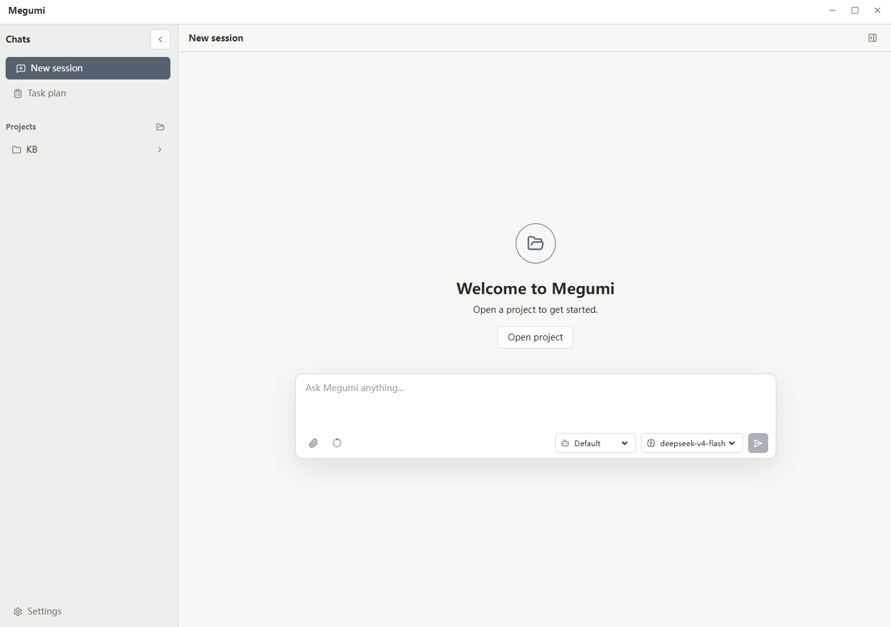

# Megumi

[English](./README.md) | [简体中文](./README.zh-CN.md)

Megumi is a local-first desktop coding agent for working with real codebases.

It brings a Codex-style development workflow into a desktop app: open a local workspace, configure your own model provider, ask the agent to understand the project, make changes, run verification commands, and follow its work in a visible session timeline.

Megumi is built for developers who want an agentic coding workflow without giving up local workspace control.

## Preview



## Why Megumi

Megumi brings a Codex-style coding agent workflow into a local desktop app.

Instead of switching between a chat window, terminal, editor, and file browser, you can work with an agent in one visible session: ask it to understand a codebase, inspect relevant files, make changes, run verification commands, and explain what happened.

Megumi is designed around a few principles:

- Local workspaces are first-class.
- You choose the model provider.
- Agent actions are visible as they happen.
- File writes and command execution go through permission policy and approval when required.
- Sessions, settings, product data, and logs stay local by default.
- Workspace changes produced by the agent are tracked in the conversation.

## What It Does

Megumi is designed to support the core work of a coding agent:

- Understand codebases: explore project structure, read relevant files, trace implementation paths, and explain how systems fit together.
- Plan changes: break down engineering tasks, reason about tradeoffs, and propose implementation steps before editing.
- Modify code: implement features, fix bugs, refactor modules, update tests, and adjust documentation when needed.
- Use tools: search files, inspect code, edit the workspace, run commands, execute tests, and collect diagnostics.
- Debug systematically: read errors, reproduce failures, trace root causes, apply targeted fixes, and verify the result.
- Review work: summarize changes, identify risks, surface missing tests, and help prepare code for review.
- Manage context: build each model call from project instructions, active session history, current-run tool results, rolling summaries, and the selected tool set.
- Operate with approval: ask before sensitive file writes, command execution, or other high-impact actions.

## Install

Windows users can download the latest installer from GitHub Releases.

1. Download the latest `MegumiSetup.exe`.
2. Run the installer.
3. Start Megumi.
4. Configure a model provider in Settings.
5. Open a workspace and start working with the agent.

The current Windows build is unsigned, so Windows SmartScreen may show an "Unknown publisher" warning.

## Configure a Model Provider

Megumi uses model providers configured by the user.

In Settings, add a provider with:

- provider name
- protocol
- base URL
- API key
- model IDs

Megumi currently supports OpenAI-compatible and Anthropic protocol adapters.

Provider settings are stored locally under the Megumi home directory.

## Local-First Data

Megumi stores local app data under:

```text
~/.megumi
```

This includes local settings, sessions, business database files, logs, and provider configuration.

Workspace operations happen on your local machine. Prompts and relevant workspace context are sent only to the model provider you configure.

## Development

Install dependencies:

```bash
npm install
```

Start the desktop app:

```bash
npm start
```

Run tests:

```bash
npm test
```

Type-check:

```bash
npx tsc --noEmit
```

Package the app:

```bash
npm run package
```

## Repository Layout

```text
apps/desktop          Electron desktop app
packages/coding-agent Core coding agent runtime
packages/product      Product host interface and composition
packages/ai           Model provider protocol layer
tests                 Vitest test suite
```

## Contributing

Contributions are welcome.

Please keep changes focused, avoid committing local runtime data or secrets, and run tests before opening a pull request.

## License

MIT License.
