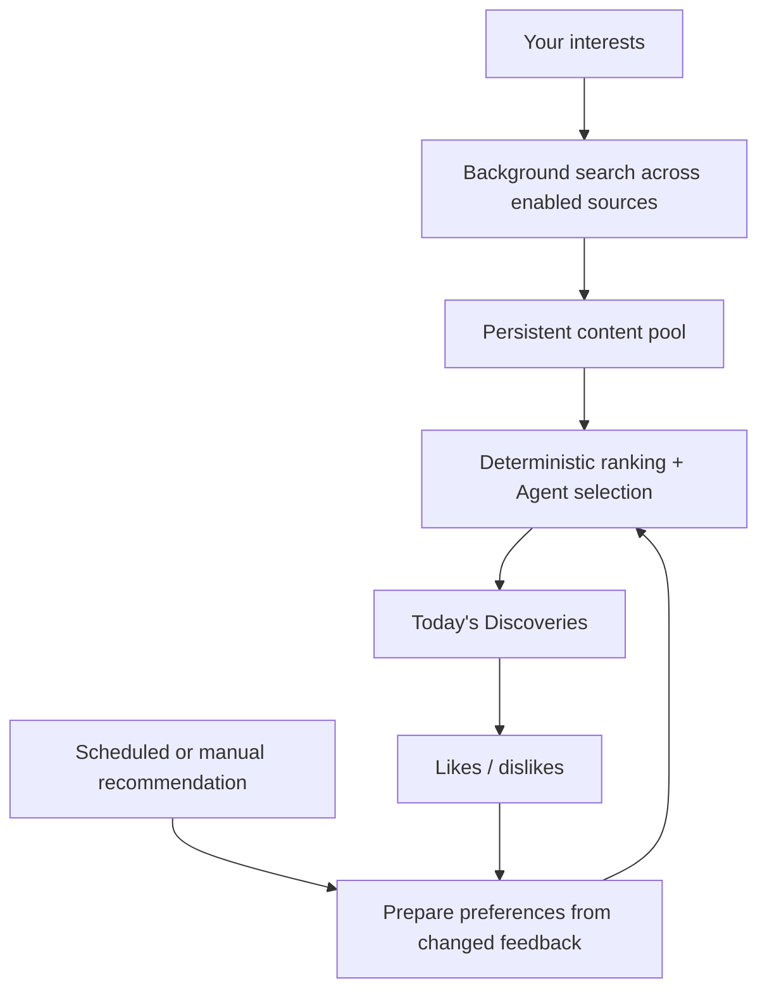

# Megumi

[English](./README.md) | [简体中文](./README.zh-CN.md)

**A cross-platform content recommendation Agent that searches around your interests, learns from your feedback, and brings relevant content into one daily feed.**

[](#quick-start)
[](https://www.typescriptlang.org/)
[](./LICENSE)

<p align="center">
  <a href="./assets/screenshots/today-discoveries.png">
    
  </a>
</p>

## Why Megumi

Your interests extend beyond a single platform. You might follow AI engineering, photography, and cooking, while useful content is scattered across videos, communities, and the open Web.

Tell Megumi what you want to follow in natural language, or authorize it to understand ongoing interests from your conversations. It searches enabled sources in the background and selects content for **Today's Discoveries**, with recommendation reasons and links to the originals. Feedback helps refine later recommendations; you can also inspect and correct what it learns.

Megumi is a Windows desktop application with local data storage and configurable model providers. Alongside recommendations, the same Agent supports general tasks, multimodal conversations, and tool execution.

## What You Can Do

- **Follow your interests across platforms.** Search Bilibili, Xiaohongshu, Douyin, Zhihu, X (Twitter), and the open Web through configurable source adapters.
- **Receive a personalized daily feed.** Set a schedule and target count, generate recommendations manually, and browse earlier batches, favorites, or items saved for later.
- **Control what Megumi follows and learns.** Add, edit, pause, or delete interests. Use likes and dislikes to inform recommendations, review learned preferences and their evidence, and edit or delete those preferences.
- **Continue from a recommendation.** Start a conversation with the selected content as context, then ask questions or develop the topic further.
- **Work through a general-purpose Agent.** Send text, images, and documents; use task-specific tools for Web search, file operations, and commands, with visible execution and permission controls.
- **Speak through the floating character window.** Local speech recognition turns your speech into input for the bound conversation.

Favorites, watch-later, and hide actions organize your feed. Likes and dislikes are the explicit feedback used for preference learning.

## From Interests to Recommendations

Search and recommendation run independently. Background search maintains a persistent content pool; scheduled or manual recommendation runs select from that pool instead of searching every source again.


```mermaid
flowchart TD
    I["Your interests"] --> S["Background search across enabled sources"]
    S --> P["Persistent content pool"]
    T["Scheduled or manual recommendation"] --> L["Prepare preferences from changed feedback"]
    F["Likes / dislikes"] --> L
    L --> R["Deterministic ranking + Agent selection"]
    P --> R
    R --> D["Today's Discoveries"]
    D --> F
```

- **Search ahead of time.** After the first-search confirmation, background checks replenish the pool when needed using active interests and enabled sources. Search results are deduplicated and saved for later selection.
- **Select in stages.** Deterministic filtering and ranking narrow the available pool into a working set. The Agent makes the final selection and can request additional stored content when needed. Recommendations and their content snapshots are published together in a transaction.
- **Learn when needed.** Changed feedback is processed before an eligible recommendation run. Learning accumulates evidence across rounds and revises preferences; user edits become explicit requirements. Version checks prevent outdated learning results from overwriting newer user changes.

Search completion does not directly trigger recommendation generation. If a recommendation run has no eligible content, it waits and rechecks the pool.

## Content Sources

| Source | Access |
| --- | --- |
| Bilibili | Public content search and reading |
| Xiaohongshu | Embedded browser session; login may be required |
| Douyin | Embedded browser session; login may be required |
| Zhihu | Zhihu Open Platform credential |
| X (Twitter) | TwitterAPI.io API key |
| Open Web | Configured Web search provider, with Bing RSS fallback; webpage reading |

Enable sources and configure their access in Settings. Available content and reading capabilities depend on the source; search results do not always include the full original content.

## Product Experience

**Today's Discoveries** brings recommendations, feedback, and saved items together. **Interest Management** lets you adjust interests and learned preferences. **Conversations** support both recommendation-based discussion and general tasks.

<table>
  <tr>
    <td width="50%" align="center"><strong>Interest management</strong></td>
    <td width="50%" align="center"><strong>Discovery settings</strong></td>
  </tr>
  <tr>
    <td><a href="./assets/screenshots/interest-management.png"></a></td>
    <td><a href="./assets/screenshots/discovery-settings.png"></a></td>
  </tr>
</table>

<table>
  <tr>
    <td width="50%" align="center"><strong>Start from a recommendation</strong></td>
    <td width="50%" align="center"><strong>Continue the conversation</strong></td>
  </tr>
  <tr>
    <td><a href="./assets/screenshots/recommendation-conversation-start.png"></a></td>
    <td><a href="./assets/screenshots/recommendation-conversation.png"></a></td>
  </tr>
</table>

## Agent Harness

Megumi's execution infrastructure supports general conversation, background search, and personalized recommendation through task-specific instructions, context, and tools.

| Layer | Responsibility |
| --- | --- |
| [AI](./packages/ai/) | Model protocols, provider adapters, authentication, and streaming responses |
| [Agent Core](./packages/agent-core/) | Product-neutral Agent loop, execution state, model calls, tool-call progression, and cancellation |
| [Harness modules](./packages/agent/) | Input processing, context, sessions, tool binding, permissions, sandboxing, business workflows, and observability |

The desktop application and evaluation host use the same application composition with their own platform adapters. These are internal code boundaries within one product.

- **Model and input adaptation.** Support multiple model protocols, images, document inputs (PDF, DOCX, TXT, and Markdown), and local speech recognition. Image understanding depends on the selected model's capabilities.
- **Task-driven tools.** Bind tools and Skills to the current task and workspace, with controlled concurrent execution, timeout handling, and cancellation.
- **Long-task continuity.** Durable tree-shaped sessions preserve conversation branches. Layered context compaction retains goals and task state in rolling summaries, with recovery when a model reports context overflow.
- **Permissions and sandboxing.** Approval controls and a Windows sandbox constrain file, process, and network access during tool execution.
- **Trace and log diagnostics.** Follow context construction, model requests, tool calls, source access, and business submission through linked execution records and a desktop diagnostics view.

## Evaluation

The [Agent evaluation platform](./evals/agent/README.md) covers conversation, interest understanding, content supply, recommendation, and preference learning. The controlled suite contains **8 datasets and 23 cases**, including recommendation quality and preference changes across successive rounds.

Each case runs through the product's business entry points in an isolated environment. It preserves initial and final state, Trace records, and file artifacts. Execution is separate from scoring, so saved evidence can be reviewed without another model run.

- **Automatic scoring:** business constraints, model and tool usage, Token consumption, and execution time.
- **Human semantic review:** relevance, preference evidence, and recommendation reasons, using explicit review criteria.
- **Case-level comparison:** identify regressions and missing evidence between comparable runs.

Validate datasets and inspect the metric catalog without making model calls:

```bash
npm run eval:agent -- datasets validate
npm run eval:agent -- metrics list
```

Running Agent cases requires an explicit model configuration and credentials. See the [evaluation guide](./evals/agent/README.md) for execution, scoring, and comparison commands.

## Quick Start

Megumi currently supports Windows 10 and Windows 11. This README describes the source implementation; packaged releases may lag behind it.

1. Download an installer from [GitHub Releases](https://github.com/anwen0724/megumi/releases), or [run from source](#build-from-source).
2. Open Settings and configure a supported model provider and its authentication.
3. Enable content sources and supply any required credentials or browser login.
4. Add an interest in Interest Management. Conversation-based interest understanding is optional and requires authorization.
5. Choose the recommendation time and count, then confirm the first background search when prompted.
6. Generate Today's Discoveries manually or wait for the scheduled run. Initial recommendations may wait for the content pool to become available.

Application state is stored under `~/.megumi` by default; `MEGUMI_HOME` can override this location. Model requests and content searches use external services. Local speech recognition runs on the device.

## Model Support

Supported API protocols:

- OpenAI Completions
- OpenAI Responses
- OpenAI Codex Responses
- Anthropic Messages
- Google Generative AI

Use the built-in provider catalog or configure a custom provider with a supported protocol, base URL, model ID, and authentication.

## Repository Structure

```text
apps/desktop/                  Electron main process, preload bridge, and React UI
packages/
├── ai/                        Model protocols and provider adapters
├── agent-core/                Product-neutral Agent loop
└── agent/                     Harness and product modules
    ├── composition/           Application assembly for desktop and evaluation
    ├── product-host/          Host operations and UI-facing contracts
    ├── discovery/             Interests, content supply, recommendations, preferences
    ├── execution/             Task lifecycle and business integration
    ├── input/                 Text, images, documents, and command input
    ├── context/               Context construction and compaction
    ├── session/               Persistent sessions and branches
    ├── tools/                 Tool definitions, binding, and scheduling
    ├── permissions/           Authorization and approvals
    ├── sandbox/               Windows execution boundaries
    ├── observability/         Traces, logs, and diagnostic queries
    ├── voice/                 Local speech recognition
    └── …                      Storage, settings, Skills, workspace, and events

evals/agent/                   Datasets, isolated runs, scoring, and comparisons
tests/                         Automated tests and architecture guards
assets/                        Screenshots and public assets
```

## Build from Source

Requirements: Windows 10/11, Node.js 24 with npm (the release workflow uses 24.14.0), and Git.

```bash
npm ci
npm start
```

Run the project checks:

```bash
npm run typecheck:packages
npm run typecheck:product
npm run typecheck:evals
npm test
```

Build an unpacked application or a Windows installer:

```bash
npm run package
npm run make
```

Electron Forge writes build output to `out/`.

## Acknowledgements

Megumi's model provider layer is based on the [`pi` AI package](https://github.com/earendil-works/pi) and adapted to Megumi's supported provider surface and desktop composition.

## License

Megumi is licensed under the [MIT License](./LICENSE).
