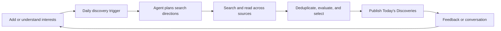
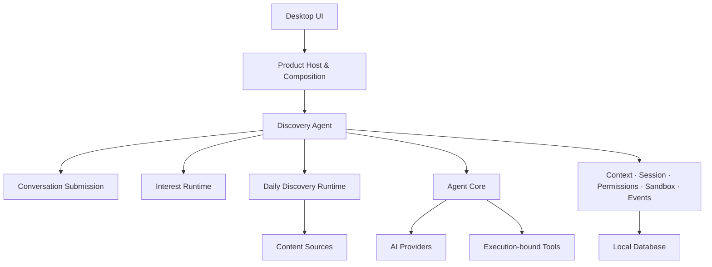

# Megumi

[English](./README.md) | [简体中文](./README.zh-CN.md)

**A personal information-discovery Agent that follows what you care about and brings back relevant content every day.**

[](#quick-start)
[](https://www.typescriptlang.org/)
[](./LICENSE)

<p align="center">
  <a href="./assets/screenshots/today-discoveries.png">
    
  </a>
</p>

## Why Megumi

People rarely care about only one stable topic. You may be following Agent engineering, graduate recruitment, and local food at the same time, while each interest keeps changing as your work and life move forward.

The useful information is scattered across video platforms, blogs, communities, and the open Web. Search engines make you repeat queries, subscription tools make you maintain keywords and feeds, and platform recommenders understand only what you do inside one platform.

Megumi turns this recurring search work into a daily product experience. Tell it what you want to follow in natural language—or allow it to understand durable interests from your conversations—and it will actively search across enabled sources, filter candidates, and assemble the results into **Today's Discoveries**.

> **Megumi understands what you currently care about and finds relevant information for you every day.**

## What You Can Do

- **Describe any interest naturally.** An interest can be a word, a sentence, or a detailed description of what you want to follow.
- **Receive a daily discovery feed.** Browse today's recommendations and earlier daily batches in chronological order.
- **Discover content across sources.** The current release connects Bilibili and the open Web through an extensible source boundary.
- **Let the Agent search and select.** Megumi plans queries, searches enabled sources, reads candidates, removes duplicates, and publishes only the items it explicitly selects.
- **Control your discovery profile.** Review, edit, pause, resume, or delete the interests Megumi currently understands.
- **Tune the daily run.** Choose the generation time, target recommendation count, content sources, and whether authorized conversations may contribute interest signals.
- **Teach Megumi through feedback.** Like, dislike, hide, favorite, or save a recommendation for later.
- **Continue from a recommendation.** Open a new conversation grounded in the selected recommendation and discuss it with Megumi.
- **Work with Megumi as a general-purpose Agent.** Beyond content discovery, use multi-turn conversations to let Megumi understand tasks, call the tools available to the current execution, and complete work.
- **Talk through the anime character window.** Open the floating character and speak naturally; local speech recognition sends what you say into the bound Megumi conversation.

## The Daily Discovery Loop


```mermaid
flowchart LR
    A["Add or understand interests"] --> B["Daily discovery trigger"]
    B --> C["Agent plans search directions"]
    C --> D["Search and read across sources"]
    D --> E["Deduplicate, evaluate, and select"]
    E --> F["Publish Today's Discoveries"]
    F --> G["Feedback or conversation"]
    G --> A
```

This is not a fixed keyword crawler. Each discovery execution receives the user's current interests, enabled sources, prior recommendations, and feedback. The Agent can adjust its search plan during the run, but only its final validated selection is persisted and shown in the product.

## Product Experience

Megumi brings three activities into one desktop product:

1. **Today's Discoveries** — read the daily recommendation feed, search published recommendations, and revisit favorites or saved items.
2. **Interest Management** — see what Megumi currently follows for you and adjust the daily discovery settings.
3. **Recommendation Conversations** — start a new conversation from a recommendation without losing the content that motivated it.

<table>
  <tr>
    <td width="50%" align="center"><strong>Interest management</strong></td>
    <td width="50%" align="center"><strong>Discovery settings</strong></td>
  </tr>
  <tr>
    <td><a href="./assets/screenshots/interest-management.png"></a></td>
    <td><a href="./assets/screenshots/discovery-settings.png"></a></td>
  </tr>
</table>

<table>
  <tr>
    <td width="50%" align="center"><strong>Start from a recommendation</strong></td>
    <td width="50%" align="center"><strong>Continue the conversation</strong></td>
  </tr>
  <tr>
    <td><a href="./assets/screenshots/recommendation-conversation-start.png"></a></td>
    <td><a href="./assets/screenshots/recommendation-conversation.png"></a></td>
  </tr>
</table>

## Current Status

Megumi is under active development. The current implementation includes:

- a Windows desktop application built with Electron and React;
- local persistence for interests, daily batches, recommendations, feedback, sessions, and settings;
- scheduled and manual daily discovery generation;
- Bilibili and open-Web content sources;
- recommendation search, favorites, watch-later state, and feedback;
- conversation-driven interest extraction when explicitly enabled;
- recommendation-grounded conversations;
- provider-neutral Agent execution with tools, permissions, sandboxing, session history, and observability.

Application state is stored locally under `~/.megumi`. Model requests and content discovery still communicate with the external providers and sources configured by the user.

## Quick Start

Megumi currently targets Windows 10 and Windows 11.

1. Download the installer from [GitHub Releases](https://github.com/anwen0724/megumi/releases).
2. Open Settings and configure a supported model provider and credential.
3. Configure the Web search credential used by the open-Web source when needed.
4. Open **Manage Interests** and describe something you want to keep following.
5. Choose the generation time, recommendation count, and enabled sources.
6. Generate today's discoveries manually or wait for the scheduled run.

## Model Support

Megumi integrates model providers through these API protocols:

- OpenAI Completions
- OpenAI Responses
- OpenAI Codex Responses
- Anthropic Messages
- Google Generative AI

The application includes a provider and model catalog. A custom provider can be configured with a supported protocol, base URL, model ID, and credential.

## How It Is Built

The modules below are internal responsibility boundaries:


```mermaid
flowchart TD
    UI["Desktop UI"] --> PH["Product Host & Composition"]
    PH --> DA["Discovery Agent"]
    DA --> CONV["Conversation Submission"]
    DA --> INT["Interest Runtime"]
    DA --> DAILY["Daily Discovery Runtime"]
    DAILY --> SRC["Content Sources"]
    DA --> CORE["Agent Core"]
    CORE --> AI["AI Providers"]
    CORE --> TOOLS["Execution-bound Tools"]
    DA --> HARNESS["Context · Session · Permissions · Sandbox · Events"]
    HARNESS --> DB["Local Database"]
```

- **Agent Core** owns the product-neutral Agent loop, explicit execution state, model calls, and tool-call progression.
- **Discovery Agent** combines conversations, interests, content sources, daily execution, recommendation selection, and persistence into Megumi's product behavior.
- **AI and Tools** expose provider-neutral model access and execution-bound tool routing.
- **Harness modules** provide context construction, durable sessions, permissions, sandbox enforcement, runtime events, and diagnostics around the loop.
- **Product Host** composes these capabilities and exposes renderer-safe operations to the desktop UI.

## Repository Structure

```text
apps/desktop/              Electron main process, preload bridge, and React UI

packages/
├── agent                  Product-neutral Agent loop and execution state
├── discovery-agent        Megumi's conversation and daily-discovery behavior
├── ai                     Provider-neutral models and provider adapters
├── tools                  Tool definitions, bindings, routing, and execution
├── context                Model-context construction and compaction
├── session                Durable semantic conversation history
├── product                Product composition and renderer-safe Host APIs
├── permissions            Authorization and approval decisions
├── sandbox                Enforced file, process, and network boundaries
├── database               Schema, migrations, and transaction boundary
├── settings               Product settings and provider credentials
├── events                 Runtime event protocol and event bus
├── observability          Traces, measurements, logs, and diagnostics
├── workspace              Workspace access and durable change facts
├── instructions           Base and effective instruction sources
└── skills                 Skill discovery, loading, and selection

tests/                     Automated tests and architecture guards
assets/                    Public screenshots and README assets
```

## Build from Source

Requirements:

- Windows 10 or Windows 11
- a current Node.js LTS release and npm
- Git

Install dependencies and start the desktop application:

```bash
npm ci
npm start
```

Run the project checks:

```bash
npm run typecheck:packages
npm run typecheck:product
npm test
```

Build an unpacked application or a Windows installer:

```bash
npm run package
npm run make
```

Electron Forge writes build output to `out/`.

## Acknowledgements

Megumi's model provider layer is based on the [`pi` AI package](https://github.com/earendil-works/pi) and adapted to Megumi's supported provider surface and desktop composition.

## License

Megumi is licensed under the [MIT License](./LICENSE).
