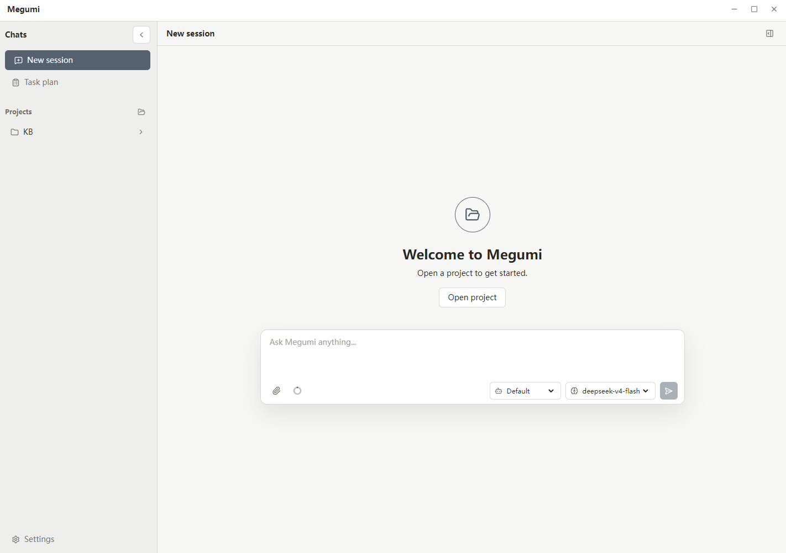
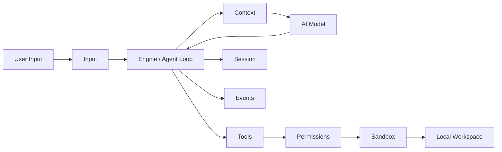

# Megumi

[English](./README.md) | [简体中文](./README.zh-CN.md)

**A local desktop Agent system that connects models, context, tools, permissions, and persistent sessions through one execution loop.**

[](#quick-start)
[](https://www.typescriptlang.org/)
[](./LICENSE)



## About Megumi

Megumi is an open-source Agent system delivered as a desktop application. It provides the foundation required to run an Agent against a local workspace: accepting user input, assembling model context, streaming model responses, executing tool calls, applying permissions, recording session history, and continuing the model–tool loop until the run settles.

The system is provider-neutral. You choose the model provider and model, while Megumi supplies the execution loop and the surrounding capabilities that turn a model call into a controlled, observable Agent run.

## How It Works


```mermaid
flowchart LR
    U["User Input"] --> I["Input"]
    I --> E["Engine / Agent Loop"]
    E --> C["Context"]
    C --> A["AI Model"]
    A --> E
    E --> T["Tools"]
    T --> P["Permissions"]
    P --> S["Sandbox"]
    S --> W["Local Workspace"]
    E --> H["Session"]
    E --> V["Events"]
```

- **Engine** owns Run lifecycle and the model–tool execution loop.
- **Context** builds the provider-neutral prompt from instructions, session history, workspace facts, skills, and the tools available to the current model call.
- **AI** provides one interface for the supported model protocols and streams model output back to the Engine.
- **Tools, Permissions, and Sandbox** route actions, decide whether they are allowed or require approval, and enforce their actual execution boundary.
- **Session and Events** preserve semantic conversation history and publish the live execution process used by the desktop interface.

## Quick Start

Megumi currently provides a Windows desktop application.

1. Download the installer from [GitHub Releases](https://github.com/anwen0724/megumi/releases).
2. Start Megumi and open a local workspace.
3. Configure a model provider and credential in Settings.
4. Select a model and start a session.

## Model Configuration

Megumi supports model providers through these API protocols:

- OpenAI Completions
- OpenAI Responses
- OpenAI Codex Responses
- Anthropic Messages
- Google Generative AI

The application includes a built-in provider and model catalog. Custom providers can be configured with a supported API protocol, base URL, model ID, and credential.

Local application data is stored under:

```text
~/.megumi
```

## Build from Source

Requirements:

- Windows 10 or Windows 11
- Node.js 22.19.0 or later and npm
- Git

Install dependencies and start the desktop application:

```bash
npm ci
npm start
```

Run the project checks:

```bash
npm run typecheck:packages
npm run typecheck:product
npm test
```

Build an unpacked application or a Windows installer:

```bash
npm run package
npm run make
```

Electron Forge writes build output to `out/`.

## Repository Structure

```text
apps/desktop           Electron desktop host and user interface

packages/
├── product            Product composition, Host interface, and lifecycle
├── engine             Run lifecycle and the Agent Loop
├── input              User input and attachment processing
├── commands           Explicit command recognition and handling
├── context            Prompt construction, context budget, and compaction
├── ai                 Provider-neutral models and provider adapters
├── tools              Tool registration, routing, and execution
├── permissions        Action authorization and approval decisions
├── sandbox            Enforced file, process, and network boundaries
├── session            Semantic history, entries, and branches
├── workspace          Workspace access and change tracking
├── instructions       Base and effective instruction sources
├── skills             Skill discovery, loading, and selection
├── settings           Product configuration and provider credentials
├── database           Database schema, migrations, and transactions
├── events             Runtime event protocol and event bus
├── projections        Read models derived from runtime and session facts
└── observability      Traces, logs, measurements, and diagnostics

tests/                 Automated tests and architecture guards
assets/                Public project and README assets
```

## Acknowledgements

Megumi's model provider layer is based on the [`pi` AI package](https://github.com/earendil-works/pi) and adapted to Megumi's supported provider surface and desktop composition.

## License

Megumi is licensed under the [MIT License](./LICENSE).
