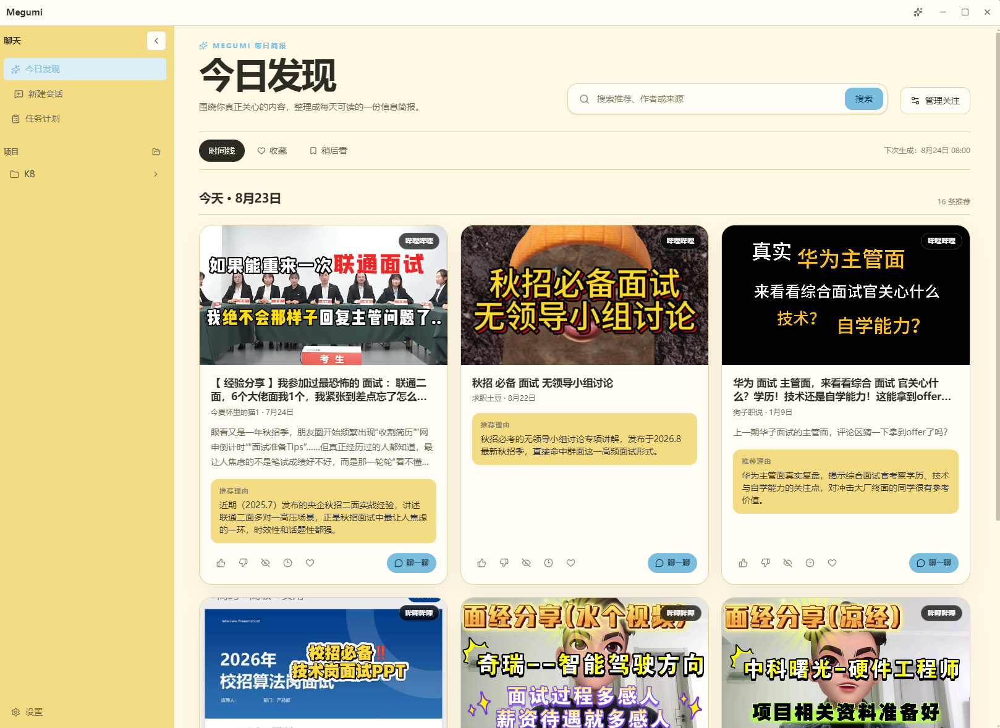
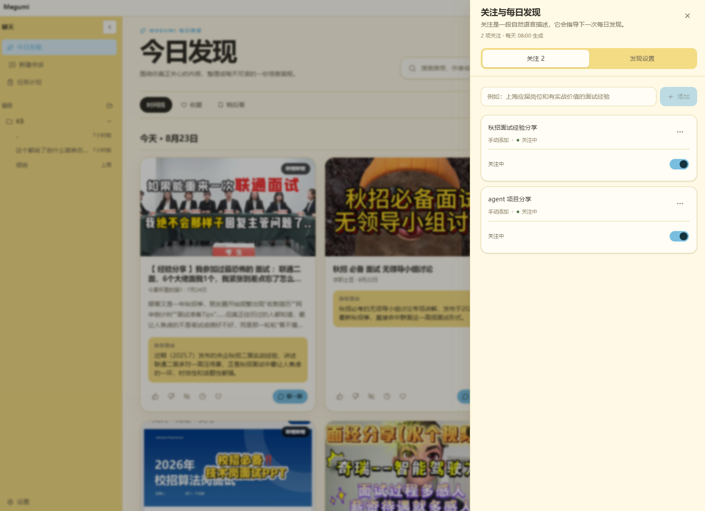
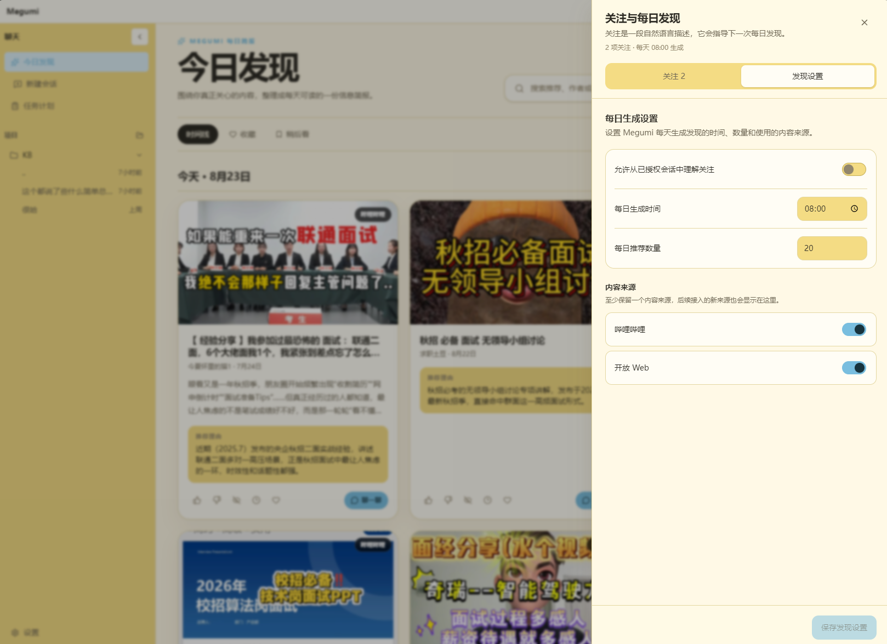
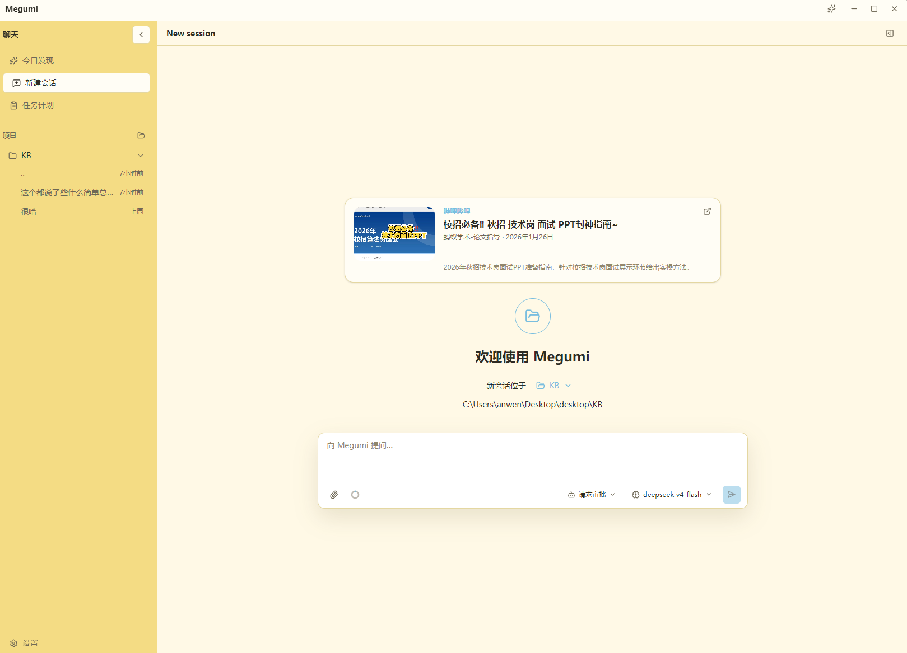
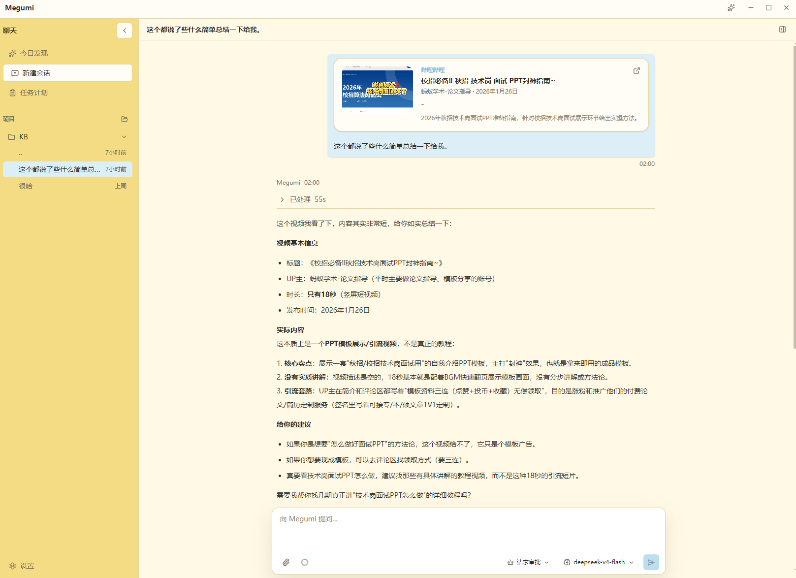
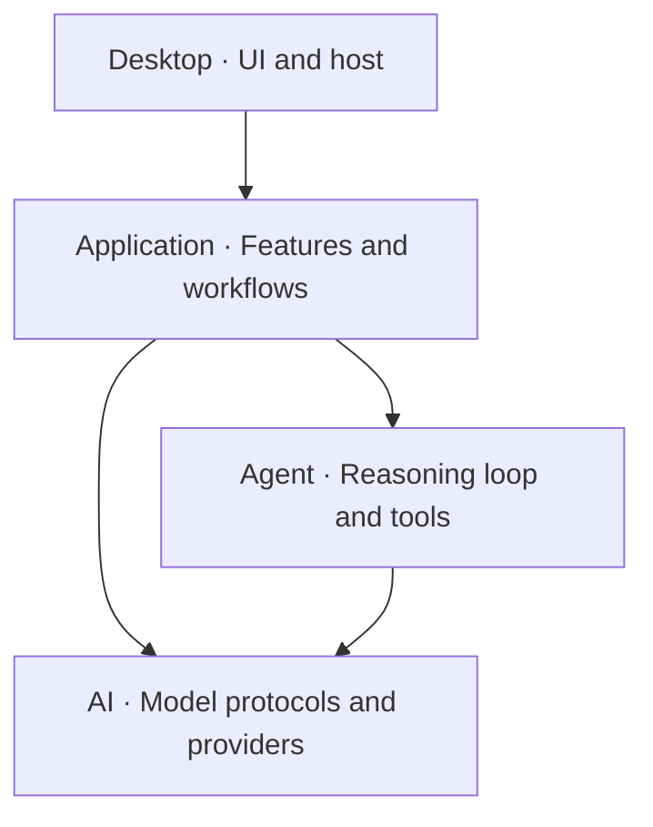

# Megumi

[English](./README.md) | [简体中文](./README.zh-CN.md)

**A desktop Agent that discovers content around your interests and helps you explore ideas and take action.**

[](#quick-start)
[](https://www.typescriptlang.org/)
[](./LICENSE)

[Download](https://github.com/anwen0724/megumi/releases) · [Quick Start](#quick-start) · [Run from Source](#build-from-source)

<p align="center">
  <a href="./assets/screenshots/today-discoveries.png">
    
  </a>
</p>

## Why Megumi

Your interests extend beyond a single platform. Whether you are following AI engineering, preparing for interviews, or exploring photography and cooking, useful information is scattered across videos, communities, and the open Web. Finding it takes repeated searches, followed by deciding what is worth your time.

Tell Megumi what you want to explore in natural language. It searches around your interests and brings back daily updates and curated recommendations. Save interesting content, start a conversation about it, ask follow-up questions, or let the Agent help with a related task.

Megumi is a Windows desktop application for personal use, with configurable model providers and local storage for conversations and application data. Beyond content discovery, you can use it as an everyday Agent assistant through text, images, documents, or voice.

## What You Can Do

- **Discover content around your interests.** Describe what you want to explore, and add, edit, pause, or delete interests at any time to reduce repeated searches across platforms.
- **Browse daily updates and curated recommendations.** Catch up on recent relevant content, read recommendations with reasons, open original links, or save favorites for later.
- **Continue the conversation.** Bring recommended content into a conversation to ask questions and discuss ideas, or start an independent task.
- **Let the Agent help you get things done.** Use Web search, file operations, and commands, follow the execution process, and control which actions are allowed through permissions.
- **Build reusable memories.** Extract experience from past tasks for later conversations, with viewing and editing support. This capability is still being refined.
- **Talk through voice.** Speak through the floating character window; local speech recognition sends your input to the bound conversation.
- **Choose your models.** Use built-in providers or add custom services with your own model and authentication settings. Image understanding depends on the selected model.

## Content Sources

The following content sources are integrated:

| Platform or source | Content and access |
| --- | --- |
| Bilibili | Video search, descriptions, and available subtitles; some access may require login. |
| Xiaohongshu | Note search and reading through an embedded browser, using a platform login session. |
| Zhihu | Answer and article search and retrieval, using Open Platform credentials or a browser session depending on the access path. |
| Open Web | Tavily search and extraction, Bing RSS fallback search, and direct reading of public webpages. |

Choose sources in Settings and supply credentials or sign in as needed. Access and reading coverage depend on each platform; search results do not always include full content. Xiaohongshu search reliability is still being improved, and signed-in Zhihu detail retrieval has not yet been verified.

“Cross-platform” refers to content from different platforms. The desktop application currently supports **Windows 10 / 11**.

## Product Experience

**Daily Updates** helps you follow recent relevant information, while **Curated Recommendations** offers content worth a closer look. Adjust interests and sources at any time, and keep content in favorites for later.

The screenshots below show interest and source management, and conversations started from recommendations. They come from an earlier version; the current layout may differ.

<table>
  <tr>
    <td width="50%" align="center"><strong>Interest management</strong></td>
    <td width="50%" align="center"><strong>Content sources and settings</strong></td>
  </tr>
  <tr>
    <td><a href="./assets/screenshots/interest-management.png"></a></td>
    <td><a href="./assets/screenshots/discovery-settings.png"></a></td>
  </tr>
</table>

When something catches your interest, bring it into a conversation to discuss ideas, find more information, or work on a task. You can also start a conversation independently.

<table>
  <tr>
    <td width="50%" align="center"><strong>Start from a recommendation</strong></td>
    <td width="50%" align="center"><strong>Continue the conversation</strong></td>
  </tr>
  <tr>
    <td><a href="./assets/screenshots/recommendation-conversation-start.png"></a></td>
    <td><a href="./assets/screenshots/recommendation-conversation.png"></a></td>
  </tr>
</table>

## Architecture

Megumi is built with Electron, React, and TypeScript. The desktop accesses conversations, recommendations, memory, and voice through the application layer. That layer organizes business workflows and uses Agent execution or direct model calls as each task requires.


```mermaid
flowchart TD
    Desktop["Desktop · UI and host"] --> Application["Application · Features and workflows"]
    Application --> Agent["Agent · Reasoning loop and tools"]
    Application --> AI["AI · Model protocols and providers"]
    Agent --> AI
```

| Component | Responsibility |
| --- | --- |
| [Desktop](./apps/desktop/) | React UI, Electron windows, IPC, and browser and system integration. |
| [Application](./packages/application/) | Conversations, recommendations, memory, settings, workspaces, voice, storage, and execution observability. |
| [Agent](./packages/agent/) | Reasoning loop, context management, tools and Skills, permissions, and sandboxing for different tasks. |
| [AI](./packages/ai/) | Model protocols, provider adapters, authentication, and streaming responses. |

The Agent Harness provides context, tools, and permission controls for task execution; the application layer owns business rules. Conversations and business state are persisted in SQLite, while long-term memory also uses local files. Traces and logs help inspect model requests, tool calls, and execution problems.

## Quick Start

1. Download an installer from [GitHub Releases](https://github.com/anwen0724/megumi/releases), or follow the source setup below.
2. Open Settings and configure a model provider, model, and authentication.
3. To use recommendations, configure their models and content sources, supplying credentials or platform logins as needed.
4. Open interest and source management on the recommendation page, describe an interest in natural language, and confirm that recommendations are enabled.
5. Browse daily updates and curated recommendations, or start a conversation directly. Initial content retrieval takes some time; saved results are available to revisit.

Megumi is under active development. Check the release notes for the features included in a packaged version.

Application data is stored under `~/.megumi` by default; `MEGUMI_HOME` can override this location. Model calls and content searches connect to configured external services. Local speech recognition runs on the device.

## Model Support

Supported API protocols:

- OpenAI Completions
- OpenAI Responses
- OpenAI Codex Responses
- Anthropic Messages
- Google Generative AI

Use the built-in provider catalog or add a custom provider with a supported protocol, base URL, model ID, and authentication.

## Repository Structure

```text
apps/desktop/                  Electron main process, preload bridge, and React UI
packages/
├── ai/                        Model protocols and provider adapters
├── agent/                     Shared Agent execution capabilities
│   └── src/                   execution, context, tools, resources, permissions, sandbox
└── application/               Application operations, lifecycle, and business modules
    ├── src/                   conversations, recommendations, memory, settings, workspace, voice, storage, observability
    └── resources/             SQL migrations, instructions, built-in skills, and voice resources

tests/                         Automated tests and architecture guards
evals/memory/                  Memory evaluation scenarios and execution entry points
assets/                        Screenshots and public assets
```

## Build from Source

Requirements: Windows 10/11, Node.js 24, npm, and Git.

Install dependencies and start the development environment:

```bash
npm ci
npm start
```

Run type checks and tests:

```bash
npm run typecheck:packages
npm run typecheck:product
npm test
```

Build an application directory or a Windows installer:

```bash
npm run package
npm run make
```

Build output is written to `out/desktop/`. Startup, packaging, and test commands prepare the native SQLite dependency for their respective runtime environments.

## Acknowledgements

Megumi's model provider layer is based on the [`pi` AI package](https://github.com/earendil-works/pi), adapted to the project's needs.

## License

Megumi is licensed under the [MIT License](./LICENSE).
