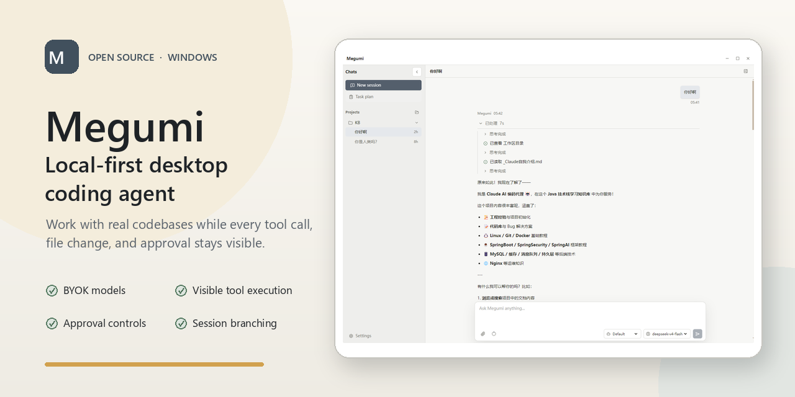

# Megumi

[English](./README.md) | [简体中文](./README.zh-CN.md)

**一个面向 Windows 的本地优先桌面 Coding Agent。**

打开真实代码库，接入你自己的模型供应商，让 Megumi 检查文件、修改代码、运行命令并验证结果；整个过程都会显示在可追踪的会话时间线中。

[](#项目状态)
[](#开发)
[](./LICENSE)
[](https://www.typescriptlang.org/)

**本地优先工作区 · BYOK 模型 · 可见工具执行 · 审批控制 · 会话分支**



## 为什么是 Megumi

Megumi 把 Codex 风格的 Coding Agent 工作流放进一个本地桌面应用里。

你不需要在聊天窗口、终端、编辑器和文件浏览器之间来回切换，而是可以在一个可见会话中和 agent 协作：让它理解代码库、检查相关文件、修改代码、运行验证命令，并解释发生了什么。

Megumi 的设计原则：

- 本地工作区是一等公民。
- 模型供应商由你自己选择。
- Agent 的动作会在运行过程中可见。
- 文件写入和命令执行会经过权限策略，并在需要时请求审批。
- 会话、设置、产品数据和日志默认保存在本地。
- Agent run 产生的工作区文件改动会在对话中追踪。

## 它能做什么

Megumi 设计用于支持 Coding Agent 的核心开发工作：

- 理解代码库：探索项目结构、读取相关文件、追踪实现路径，并解释系统如何组合在一起。
- 规划改动：拆解工程任务，分析取舍，并在编辑前提出实现步骤。
- 修改代码：实现功能、修复 bug、重构模块、更新测试，并在需要时调整文档。
- 使用工具：搜索文件、检查代码、编辑工作区、运行命令、执行测试并收集诊断信息。
- 系统化调试：阅读错误、复现失败、追踪根因、应用有针对性的修复，并验证结果。
- 审查工作：总结改动、识别风险、指出缺失测试，并帮助准备代码审查。
- 管理上下文：为每次模型调用组合项目指令、当前会话历史、本次 run 的工具结果、滚动摘要和选定工具集合。
- 审批后执行：在敏感文件写入、命令执行或其它高影响操作前请求确认。

## 项目状态

Megumi 正在持续开发，目前处于 Windows 早期预览阶段。公开安装包尚未发布，在此之前可以按照下方步骤从源码启动。

当前 Windows 构建尚未签名，因此未来的预览安装包可能触发 Windows SmartScreen 的 “Unknown publisher” 提示。

你可以关注 [GitHub Releases](https://github.com/anwen0724/megumi/releases)，等待第一个公开安装包发布。

## 配置模型供应商

Megumi 使用用户自己配置的模型供应商。

在 Settings 中添加供应商时，需要配置：

- provider name
- protocol
- base URL
- API key
- model IDs

Megumi 当前通过 OpenAI-compatible Adapter 验证了 DeepSeek V4 Flash 和 DeepSeek V4 Pro，也支持配置自定义 OpenAI-compatible 地址和模型 ID。Anthropic 协议 Adapter 尚未实现。

Provider settings 会保存在本地 Megumi home 目录下。

## 本地优先数据

Megumi 的本地应用数据保存在：

```text
~/.megumi
```

其中包括本地设置、会话、业务数据库文件、日志和 provider 配置。

工作区操作发生在你的本机。Prompt 和相关工作区上下文只会发送给你配置的模型供应商。

## 开发

安装依赖：

```bash
npm install
```

启动桌面应用：

```bash
npm start
```

运行测试：

```bash
npm test
```

类型检查：

```bash
npx tsc --noEmit
```

打包应用：

```bash
npm run package
```

## 仓库结构

```text
apps/desktop          Electron desktop app
packages/coding-agent Core coding agent runtime
packages/product      Product host interface and composition
packages/ai           Model provider protocol layer
tests                 Vitest test suite
```

## 贡献

欢迎贡献。

请保持改动聚焦，不要提交本地运行数据、密钥或私有文档，并在提交 PR 前运行测试。

## License

MIT License.
