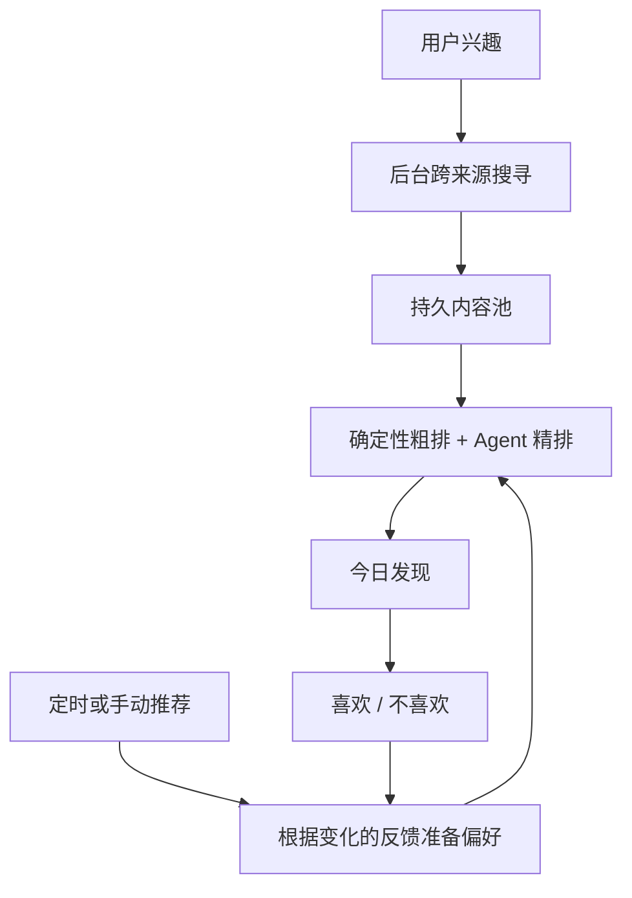

# Megumi

[English](./README.md) | [简体中文](./README.zh-CN.md)

**跨平台个性化内容推荐 Agent：围绕你的兴趣搜寻内容，从反馈中学习偏好，将值得关注的信息汇集成每日推荐。**

[](#快速开始)
[](https://www.typescriptlang.org/)
[](./LICENSE)

<p align="center">
  <a href="./assets/screenshots/today-discoveries.png">
    
  </a>
</p>

## 为什么做 Megumi

你的兴趣不局限于一个平台。无论是 AI 工程、摄影还是烹饪，相关内容往往散落在视频平台、社区和开放网页中。

用自然语言告诉 Megumi 想持续了解什么，也可以授权它从会话中理解兴趣。它会在后台搜寻已启用的来源，将筛选后的内容整理成 **“今日发现”**，附上推荐理由和原文链接。反馈帮助它调整后续推荐，你也可以查看和纠正它学到的偏好。

Megumi 是一款采用本地数据存储、支持自选模型服务的 Windows 桌面应用。同一个 Agent 也支持通用任务、多模态对话和工具执行。

## 你可以用 Megumi 做什么

- **围绕兴趣跨平台搜寻。** 通过可配置的来源适配器，从 Bilibili、小红书、抖音、知乎、X（Twitter）及开放网页寻找内容。
- **获取个性化每日推荐。** 设置生成时间和目标数量，也可以手动生成，回看历史推荐、收藏和稍后看的内容。
- **管理兴趣与学到的偏好。** 添加、修改、暂停或删除兴趣；通过喜欢和不喜欢影响推荐，查看偏好及其依据，并直接修改或删除。
- **围绕推荐继续讨论。** 从一条推荐开启会话，带入对应内容上下文，继续提问或深入了解。
- **完成通用 Agent 任务。** 输入文字、图片和文档，使用按任务提供的网页搜索、文件操作、命令执行等工具，并查看执行过程、控制操作权限。
- **通过悬浮角色窗口说话。** 本地语音识别将语音转成文字，发送到绑定的会话。

收藏、稍后看和隐藏用于整理推荐；喜欢与不喜欢是偏好学习使用的明确反馈。

## 从兴趣到推荐

搜寻与推荐独立运行：后台搜寻维护持久内容池，定时或手动推荐从池中选择内容，无需每次重新搜索各个平台。


```mermaid
flowchart TD
    I["用户兴趣"] --> S["后台跨来源搜寻"]
    S --> P["持久内容池"]
    T["定时或手动推荐"] --> L["根据变化的反馈准备偏好"]
    F["喜欢 / 不喜欢"] --> L
    L --> R["确定性粗排 + Agent 精排"]
    P --> R
    R --> D["今日发现"]
    D --> F
```

- **提前搜寻。** 用户确认首次搜寻后，后台按需检查并补充内容，结合有效兴趣和已启用来源开展搜索，去重后保存，供后续推荐使用。
- **分层筛选。** 对可用内容进行确定性过滤与粗排，将范围收敛后交给 Agent 精排；信息不足时可按需扩展和读取已存内容。最终推荐与内容快照通过事务一并发布。
- **按需学习。** 在符合执行条件的推荐开始前，处理发生变化的反馈，结合跨轮证据修订偏好；用户修改会转为明确要求，版本校验防止过期学习结果覆盖新的修改。

搜寻完成不会直接触发推荐生成；推荐时暂无可用内容，则进入等待并重新检查内容池。

## 内容来源

| 来源 | 接入方式 |
| --- | --- |
| Bilibili | 公开内容搜索与读取 |
| 小红书 | 内嵌浏览器会话，可能需要登录 |
| 抖音 | 内嵌浏览器会话，可能需要登录 |
| 知乎 | 知乎开放平台凭据 |
| X（Twitter） | TwitterAPI.io API Key |
| 开放网页 | 配置的网页搜索服务，支持 Bing RSS 回退；网页内容读取 |

在设置中启用来源并配置访问方式。可访问内容和读取能力因来源而异，搜索结果不一定包含原文全文。

## 产品体验

**今日发现**集中展示推荐、反馈和收藏内容；**兴趣管理**支持调整兴趣与学到的偏好；**会话**既可围绕推荐讨论，也可执行通用任务。

<table>
  <tr>
    <td width="50%" align="center"><strong>管理关注</strong></td>
    <td width="50%" align="center"><strong>每日发现设置</strong></td>
  </tr>
  <tr>
    <td><a href="./assets/screenshots/interest-management.png"></a></td>
    <td><a href="./assets/screenshots/discovery-settings.png"></a></td>
  </tr>
</table>

<table>
  <tr>
    <td width="50%" align="center"><strong>从推荐开启会话</strong></td>
    <td width="50%" align="center"><strong>围绕内容继续讨论</strong></td>
  </tr>
  <tr>
    <td><a href="./assets/screenshots/recommendation-conversation-start.png"></a></td>
    <td><a href="./assets/screenshots/recommendation-conversation.png"></a></td>
  </tr>
</table>

## Agent Harness

面向通用对话、后台搜寻与个性化推荐，Megumi 通过任务指令、上下文和工具集适配不同的执行需求。

| 层次 | 职责 |
| --- | --- |
| [AI](./packages/ai/) | 模型协议、服务适配、认证与流式响应 |
| [Agent Core](./packages/agent-core/) | 与产品无关的 Agent 循环、执行状态、模型调用、工具调用推进与取消 |
| [Harness 模块](./packages/agent/) | 输入处理、上下文、会话、工具绑定、权限、沙箱、业务流程与可观测能力 |

桌面应用与评估 Host 使用同一应用装配入口，分别注入平台适配器。这些是同一个产品内部的代码职责划分。

- **模型与输入适配。** 支持多种模型协议、图片、文档输入（PDF、DOCX、TXT、Markdown）及本地语音识别；图片理解取决于所选模型的能力。
- **任务驱动的工具组织。** 按当前任务和工作区绑定工具与 Skills，提供受控并发、超时处理和取消机制。
- **长任务连续执行。** 持久化树形会话保留历史分支；分层上下文压缩通过滚动摘要保留目标和任务状态，并在模型报告上下文溢出时进行恢复。
- **权限与沙箱。** 通过审批控制与 Windows 沙箱约束工具执行中的文件、进程和网络访问。
- **Trace 与日志观测。** 关联上下文构建、模型请求、工具调用、来源访问和业务提交记录，通过桌面诊断界面追溯执行过程。

## 质量评估

[Agent 评估平台](./evals/agent/README.md)覆盖通用对话、兴趣理解、内容供给、推荐与偏好学习。受控题集包含 **8 个数据集、23 个样本**，包括推荐质量与连续多轮偏好变化场景。

每个样本通过正式业务入口在隔离环境中执行，保存初始／最终状态、Trace 和文件产物。执行与评分分离，已有证据可以反复评审，无需重新调用模型。

- **自动评分：** 检查业务约束，统计模型和工具调用、Token 用量及执行耗时。
- **人工语义评审：** 按明确标准评审内容相关性、偏好依据和推荐理由。
- **逐样本对照：** 比较可比运行结果，定位退化与证据缺口。

校验题集、查看指标目录，无需调用模型：

```bash
npm run eval:agent -- datasets validate
npm run eval:agent -- metrics list
```

执行 Agent 样本需要显式配置模型及凭据。运行、评分与对照命令见[评估使用说明](./evals/agent/README.md)。

## 快速开始

Megumi 当前支持 Windows 10 和 Windows 11。本文描述源码中的实现，安装包所含功能以对应版本的发布说明为准。

1. 从 [GitHub Releases](https://github.com/anwen0724/megumi/releases) 下载安装程序，或[从源码运行](#从源码运行与构建)。
2. 打开设置，配置受支持的模型服务及认证方式。
3. 启用内容来源，按需配置凭据或完成浏览器登录。
4. 在兴趣管理中添加兴趣；从会话中理解兴趣是可选能力，需要用户授权。
5. 设置推荐时间与数量，出现提示时确认首次后台搜寻。
6. 手动生成“今日发现”，或等待定时推荐；首次生成可能需要等待内容池准备就绪。

应用状态默认保存在 `~/.megumi`，可通过 `MEGUMI_HOME` 指定其他位置。模型请求和内容搜寻会访问外部服务；本地语音识别在设备上运行。

## 模型支持

支持的 API 协议：

- OpenAI Completions
- OpenAI Responses
- OpenAI Codex Responses
- Anthropic Messages
- Google Generative AI

可以使用内置模型服务目录，也可以通过受支持的协议、Base URL、Model ID 和认证配置添加自定义服务。

## 仓库结构

```text
apps/desktop/                  Electron 主进程、Preload Bridge 与 React UI
packages/
├── ai/                        模型协议与服务适配
├── agent-core/                与产品无关的 Agent 循环
└── agent/                     Harness 与产品模块
    ├── composition/           桌面与评估环境的应用装配
    ├── product-host/          Host 操作与面向 UI 的契约
    ├── discovery/             兴趣、内容供给、推荐与偏好
    ├── execution/             任务生命周期与业务接入
    ├── input/                 文字、图片、文档与命令输入
    ├── context/               上下文构建与压缩
    ├── session/               持久化会话与分支
    ├── tools/                 工具定义、绑定与调度
    ├── permissions/           授权与审批
    ├── sandbox/               Windows 执行边界
    ├── observability/         Trace、日志与诊断查询
    ├── voice/                 本地语音识别
    └── …                      存储、设置、Skills、工作区与事件等模块

evals/agent/                   数据集、隔离执行、评分与对照
tests/                         自动化测试与架构守卫
assets/                        截图与公开资源
```

## 从源码运行与构建

环境要求：Windows 10/11、Node.js 24 与 npm（发布流程使用 24.14.0）、Git。

```bash
npm ci
npm start
```

运行项目检查：

```bash
npm run typecheck:packages
npm run typecheck:product
npm run typecheck:evals
npm test
```

构建未打包应用或 Windows 安装程序：

```bash
npm run package
npm run make
```

Electron Forge 将构建产物写入 `out/`。

## 致谢

Megumi 的模型服务层基于 [`pi` 的 AI 包](https://github.com/earendil-works/pi)，并针对 Megumi 支持的模型服务和桌面装配方式进行适配。

## 许可证

Megumi 使用 [MIT 许可证](./LICENSE)。
