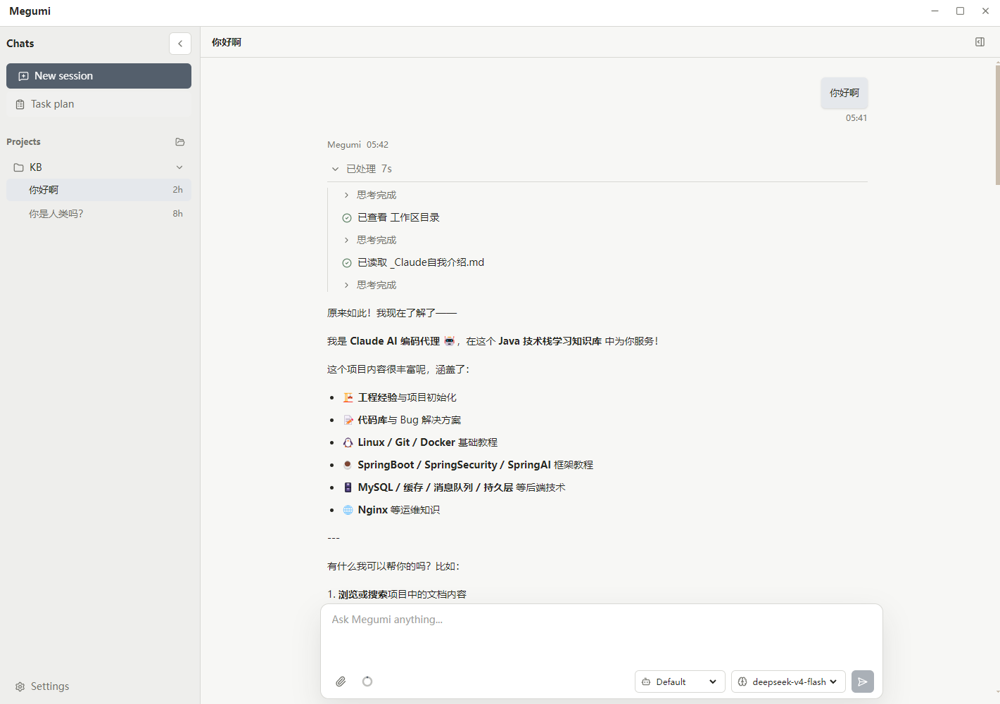
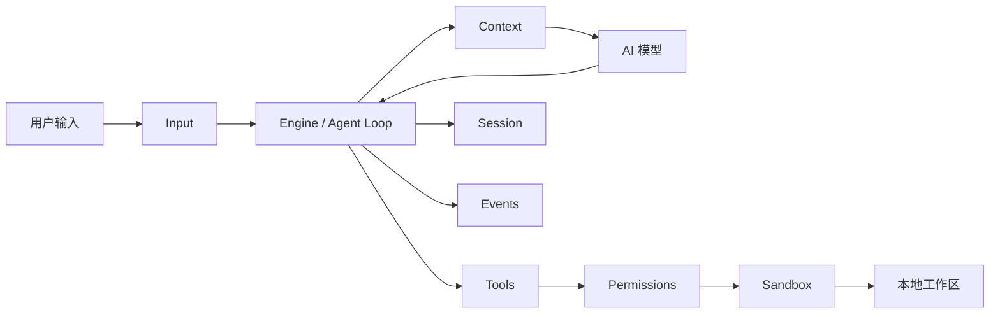

# Megumi

[English](./README.md) | [简体中文](./README.zh-CN.md)

**一个本地桌面 Agent 系统，通过统一执行循环连接模型、上下文、工具、权限与持久化会话。**

[](#快速开始)
[](https://www.typescriptlang.org/)
[](./LICENSE)



## 关于 Megumi

Megumi 是一个以桌面应用形态提供的开源 Agent 系统。它提供 Agent 在本地工作区中运行所需的基础能力：接收用户输入、组织模型上下文、流式调用模型、执行工具调用、应用权限规则、记录会话历史，并持续进行模型与工具之间的循环，直至本次运行得到确定结果。

系统不绑定单一模型供应商。用户选择模型供应商和具体模型，Megumi 提供执行循环以及围绕模型调用建立的完整运行环境，让一次模型请求成为受控制、可观察的 Agent 执行。

Megumi 采用本地优先的方式。工作区、设置、会话和运行诊断保存在本地；只有模型请求以及为该请求选择的上下文会发送给用户配置的模型供应商。

## 运行原理


```mermaid
flowchart LR
    U["用户输入"] --> I["Input"]
    I --> E["Engine / Agent Loop"]
    E --> C["Context"]
    C --> A["AI 模型"]
    A --> E
    E --> T["Tools"]
    T --> P["Permissions"]
    P --> S["Sandbox"]
    S --> W["本地工作区"]
    E --> H["Session"]
    E --> V["Events"]
```

- **Engine** 负责 Run 生命周期以及模型与工具之间的执行循环。
- **Context** 使用 Instructions、会话历史、工作区事实、Skills 和当前模型调用可用的工具，构建供应商无关的 Prompt。
- **AI** 为支持的模型协议提供统一调用接口，并将模型流式输出交回 Engine。
- **Tools、Permissions 与 Sandbox** 负责路由行动、判断行动是否允许或需要审批，并强制执行真实影响范围。
- **Session 与 Events** 保存语义会话历史，并发布桌面界面使用的实时执行过程。

## 快速开始

Megumi 当前提供 Windows 桌面应用。

1. 从 [GitHub Releases](https://github.com/anwen0724/megumi/releases) 下载安装程序。
2. 启动 Megumi 并打开一个本地工作区。
3. 在设置中配置模型供应商和凭据。
4. 选择模型并开始会话。

## 模型配置

Megumi 通过以下 API 协议接入模型供应商：

- OpenAI Completions
- OpenAI Responses
- OpenAI Codex Responses
- Anthropic Messages
- Google Generative AI

应用内提供内置供应商和模型目录。自定义供应商可以使用受支持的 API 协议、Base URL、Model ID 和 Credential 进行配置。

本地应用数据保存在：

```text
~/.megumi
```

## 从源码构建

环境要求：

- Windows 10 或 Windows 11
- 当前 Node.js LTS 版本和 npm
- Git

安装依赖并启动桌面应用：

```bash
npm ci
npm start
```

执行项目检查：

```bash
npm run typecheck:packages
npm run typecheck:product
npm test
```

构建未打包应用目录或 Windows 安装程序：

```bash
npm run package
npm run make
```

Electron Forge 将构建输出写入 `out/`。

## 仓库结构

```text
apps/desktop           Electron 桌面宿主与用户界面

packages/
├── product            产品装配、Host 接口与整体生命周期
├── engine             Run 生命周期与 Agent Loop
├── input              用户输入与附件处理
├── commands           显式命令识别与处理
├── context            Prompt 构建、上下文预算与压缩
├── ai                 供应商无关模型接口与 Provider Adapter
├── tools              工具注册、路由与执行
├── permissions        行动授权与审批判断
├── sandbox            文件、进程与网络的强制执行边界
├── session            语义历史、Entry 与会话分支
├── workspace          工作区访问与变更记录
├── instructions       基础指令与有效指令来源
├── skills             Skill 发现、加载与选择
├── settings           产品配置与模型供应商凭据
├── database           数据库 Schema、迁移与事务
├── events             Runtime Event 协议与 EventBus
├── projections        从运行和会话事实生成的读取模型
└── observability      Trace、Log、Measurement 与诊断

tests/                 自动化测试与架构守卫
assets/                项目公开展示与 README 资源
```

## 致谢

Megumi 的模型供应商接入层基于 [`pi` 的 AI Package](https://github.com/earendil-works/pi)，并根据 Megumi 支持的供应商范围和桌面装配方式进行了适配。

## 许可证

Megumi 使用 [MIT License](./LICENSE)。
