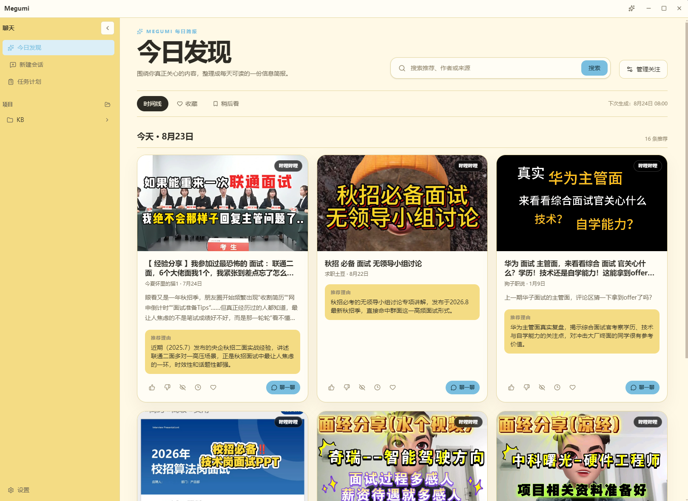
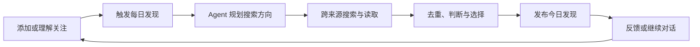
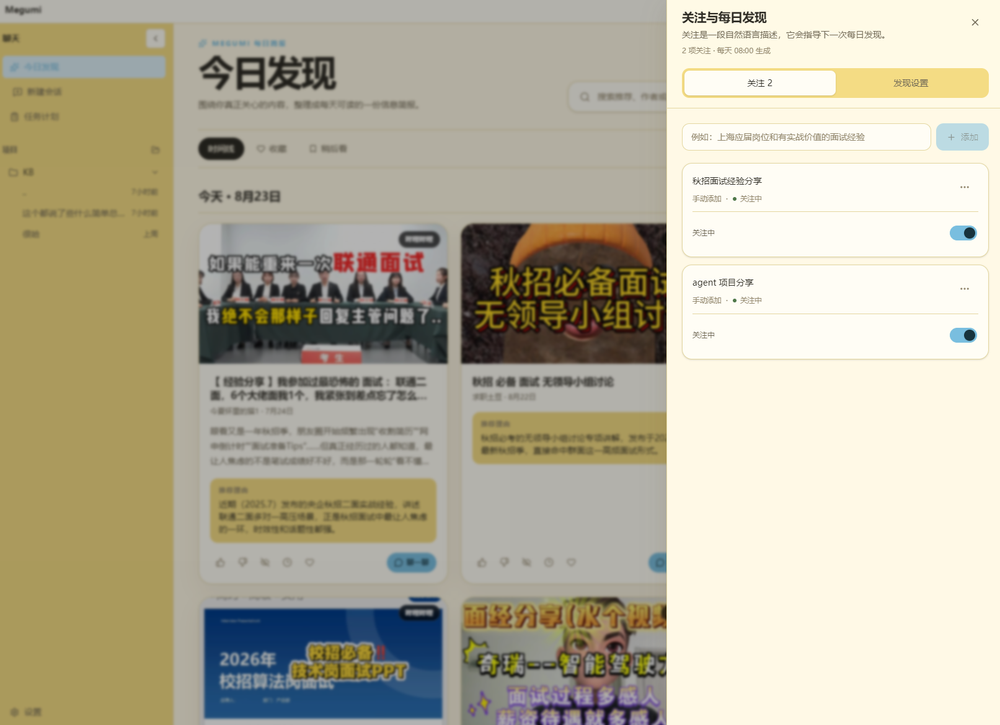
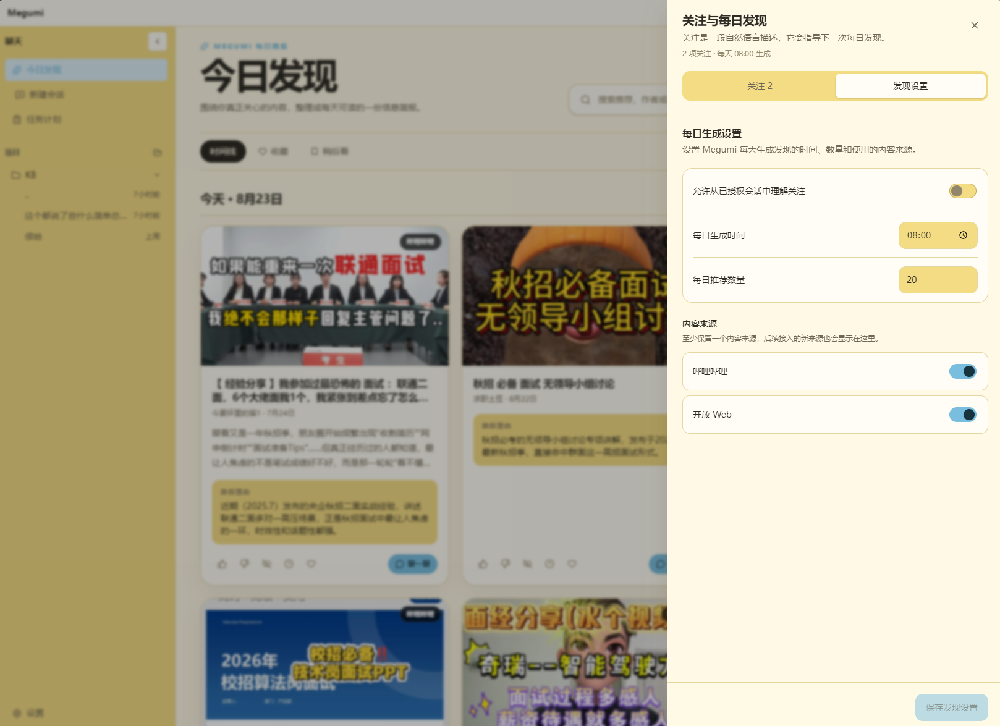
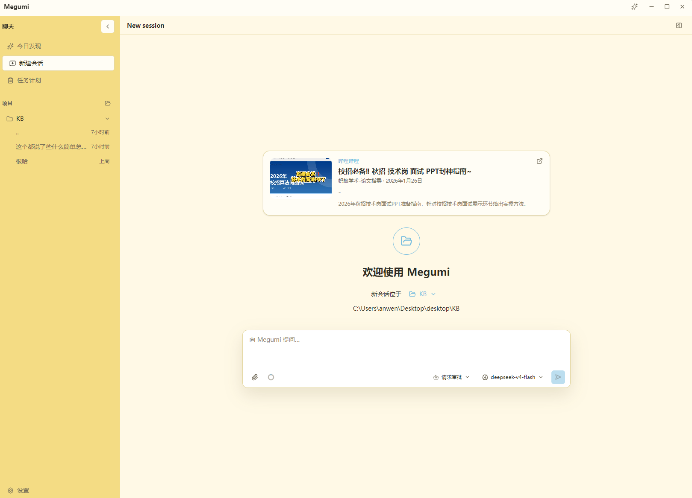
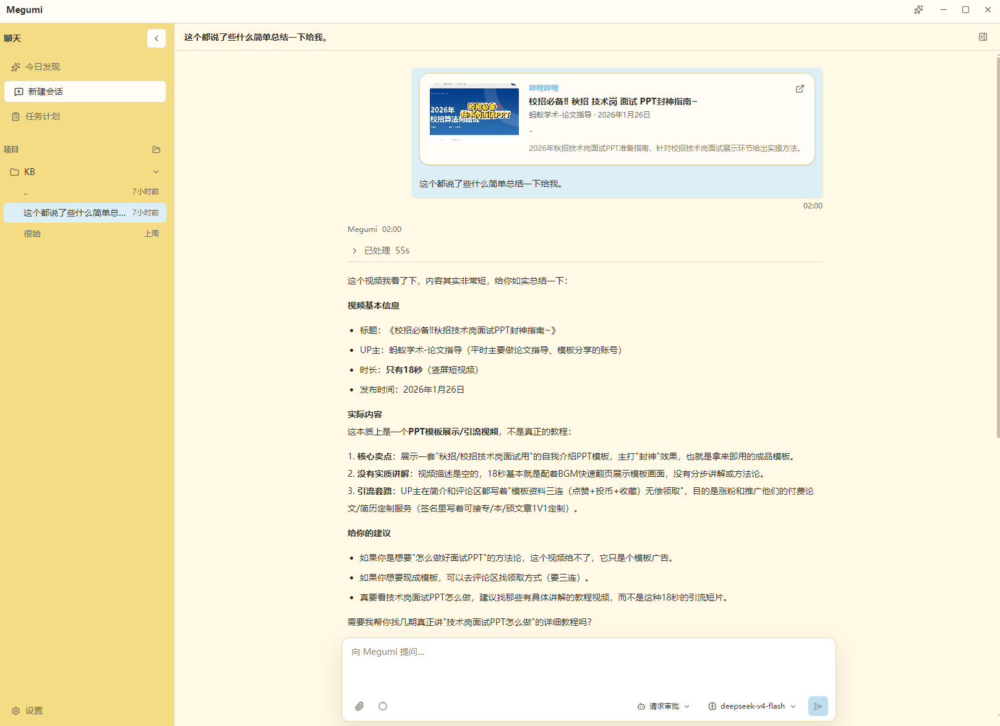
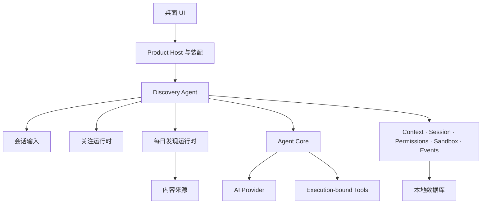

# Megumi

[English](./README.md) | [简体中文](./README.zh-CN.md)

**一个围绕你的关注，每天主动寻找并带回相关内容的个人信息发现 Agent。**

[](#快速开始)
[](https://www.typescriptlang.org/)
[](./LICENSE)

<p align="center">
  <a href="./assets/screenshots/today-discoveries.png">
    
  </a>
</p>

## 为什么做 Megumi

一个人通常会同时关注很多不断变化的事情。你可能正在学习 Agent 工程、准备秋招，也在寻找附近值得尝试的美食；这些关注还会随着工作和生活不断变化。

真正有价值的信息散落在视频平台、博客、社区和开放 Web 中。搜索引擎需要用户反复输入查询，订阅工具需要维护关键词和信息源，而内容平台通常只能理解用户在单个平台中的行为。

Megumi 把这种重复的信息搜索变成一种每日产品体验。你可以用自然语言直接告诉 Megumi 想持续关注什么，也可以授权它从会话中理解具有持续性的关注。随后，Megumi 会主动从已启用的来源搜索、筛选候选内容，并整理成每天的 **“今日发现”**。

> **Megumi 理解你当前关注什么，并每天把相关信息找回来。**

## 你可以用 Megumi 做什么

- **用自然语言描述任何关注。** 一项关注可以是一个词、一句话，也可以是对想了解内容的详细描述。
- **查看每日发现。** 按时间浏览今天和过去每天生成的推荐内容。
- **跨来源发现内容。** 当前版本已经接入哔哩哔哩和开放 Web，并为后续来源保留了扩展边界。
- **让 Agent 自主搜索和筛选。** Megumi 会规划查询、搜索已启用来源、读取候选、去重，并只发布它最终明确选择的内容。
- **管理自己的关注。** 查看、修改、暂停、恢复或删除 Megumi 当前理解的关注。
- **调整每日生成方式。** 设置生成时间、目标推荐数量、内容来源，以及是否允许从已授权会话中理解关注。
- **通过反馈影响后续发现。** 对推荐进行喜欢、不喜欢、隐藏、收藏或稍后看操作。
- **围绕推荐继续对话。** 从一条推荐开启新的会话，并让 Megumi 基于这条内容继续讨论。
- **把 Megumi 当作通用 Agent 使用。** 除内容发现外，也可以在多轮会话中让 Megumi 理解任务、调用当前执行可用的工具并完成工作。
- **通过动漫角色窗口进行语音交互。** 打开悬浮角色窗口，用自然语言说话；本地语音识别会把内容送入当前绑定的 Megumi 会话。

## 每日发现闭环


```mermaid
flowchart LR
    A["添加或理解关注"] --> B["触发每日发现"]
    B --> C["Agent 规划搜索方向"]
    C --> D["跨来源搜索与读取"]
    D --> E["去重、判断与选择"]
    E --> F["发布今日发现"]
    F --> G["反馈或继续对话"]
    G --> A
```

Megumi 不是一个固定关键词爬虫。每次发现任务都会读取用户当前的关注、启用的来源、历史推荐和反馈。Agent 可以在执行过程中调整搜索计划，但只有经过校验的最终选择才会被持久化并展示给用户。

## 产品体验

Megumi 把三类行为放在同一个桌面产品中：

1. **今日发现**：阅读每日推荐，搜索已经发布的内容，并查看收藏或稍后看的条目。
2. **关注管理**：查看 Megumi 当前为你关注的内容，并调整每日发现设置。
3. **推荐会话**：从一条推荐开启新会话，同时保留触发这次讨论的内容上下文。

<table>
  <tr>
    <td width="50%" align="center"><strong>管理关注</strong></td>
    <td width="50%" align="center"><strong>每日发现设置</strong></td>
  </tr>
  <tr>
    <td><a href="./assets/screenshots/interest-management.png"></a></td>
    <td><a href="./assets/screenshots/discovery-settings.png"></a></td>
  </tr>
</table>

<table>
  <tr>
    <td width="50%" align="center"><strong>从推荐开启会话</strong></td>
    <td width="50%" align="center"><strong>围绕内容继续讨论</strong></td>
  </tr>
  <tr>
    <td><a href="./assets/screenshots/recommendation-conversation-start.png"></a></td>
    <td><a href="./assets/screenshots/recommendation-conversation.png"></a></td>
  </tr>
</table>

## 当前实现状态

Megumi 仍在持续开发中，当前实现包括：

- 使用 Electron 和 React 构建的 Windows 桌面应用；
- 对关注、每日批次、推荐、反馈、会话和设置进行本地持久化；
- 定时和手动触发每日发现；
- 哔哩哔哩与开放 Web 内容来源；
- 推荐搜索、收藏、稍后看和反馈；
- 在用户明确启用后，从会话中提取关注；
- 基于推荐内容开启新会话；
- Provider 无关的 Agent 执行，以及工具、权限、Sandbox、会话历史和可观测能力。

应用状态默认保存在 `~/.megumi`。模型请求和内容发现仍会访问用户配置的外部模型服务与内容来源。

## 快速开始

Megumi 当前面向 Windows 10 和 Windows 11。

1. 从 [GitHub Releases](https://github.com/anwen0724/megumi/releases) 下载安装程序。
2. 打开设置，配置受支持的模型服务和凭据。
3. 需要使用开放 Web 来源时，配置对应的 Web 搜索凭据。
4. 打开“管理关注”，描述一件你想持续了解的事情。
5. 选择每日生成时间、推荐数量和内容来源。
6. 手动生成今天的发现，或者等待每日定时任务。

## 模型支持

Megumi 通过以下 API 协议接入模型服务：

- OpenAI Completions
- OpenAI Responses
- OpenAI Codex Responses
- Anthropic Messages
- Google Generative AI

应用内提供 Provider 和模型目录。自定义 Provider 可以使用受支持的协议、Base URL、Model ID 和 Credential 进行配置。

## 它是怎样实现的

Megumi 是一个完整的 Agent 产品。下面的模块只是内部代码职责划分，不是彼此独立的产品：


```mermaid
flowchart TD
    UI["桌面 UI"] --> PH["Product Host 与装配"]
    PH --> DA["Discovery Agent"]
    DA --> CONV["会话输入"]
    DA --> INT["关注运行时"]
    DA --> DAILY["每日发现运行时"]
    DAILY --> SRC["内容来源"]
    DA --> CORE["Agent Core"]
    CORE --> AI["AI Provider"]
    CORE --> TOOLS["Execution-bound Tools"]
    DA --> HARNESS["Context · Session · Permissions · Sandbox · Events"]
    HARNESS --> DB["本地数据库"]
```

- **Agent Core** 负责与具体产品无关的 Agent Loop、显式执行状态、Model Call 和 Tool Call 推进。
- **Discovery Agent** 把会话、关注、内容来源、每日执行、推荐选择和持久化组合成 Megumi 的产品行为。
- **AI 与 Tools** 提供 Provider 无关的模型访问和基于单次执行绑定的工具路由。
- **Harness 模块** 围绕 Agent Loop 提供 Context 构造、持久化会话、权限、Sandbox、运行事件和诊断能力。
- **Product Host** 负责装配这些能力，并向桌面 UI 暴露 Renderer-safe 操作。

## 仓库结构

```text
apps/desktop/              Electron 主进程、Preload Bridge 与 React UI

packages/
├── agent                  与产品无关的 Agent Loop 和执行状态
├── discovery-agent        Megumi 的会话与每日发现业务
├── ai                     Provider 无关模型接口与适配器
├── tools                  工具定义、绑定、路由与执行
├── context                模型上下文构造与压缩
├── session                持久化语义会话历史
├── product                产品装配与 Renderer-safe Host API
├── permissions            授权与审批判断
├── sandbox                文件、进程和网络执行边界
├── database               Schema、迁移与事务边界
├── settings               产品设置与 Provider 凭据
├── events                 运行事件协议与 EventBus
├── observability          Trace、Measurement、Log 与诊断
├── workspace              Workspace 访问与持久化变更事实
├── instructions           基础指令与有效指令来源
└── skills                 Skill 发现、加载与选择

tests/                     自动化测试与架构守卫
assets/                    公开截图与 README 资源
```

## 从源码构建

环境要求：

- Windows 10 或 Windows 11
- 当前 Node.js LTS 版本与 npm
- Git

安装依赖并启动桌面应用：

```bash
npm ci
npm start
```

执行项目检查：

```bash
npm run typecheck:packages
npm run typecheck:product
npm test
```

构建未打包应用或 Windows 安装程序：

```bash
npm run package
npm run make
```

Electron Forge 会将构建结果写入 `out/`。

## 致谢

Megumi 的模型 Provider 层基于 [`pi` AI Package](https://github.com/earendil-works/pi)，并针对 Megumi 支持的 Provider 范围和桌面装配方式进行了调整。

## 许可证

Megumi 使用 [MIT License](./LICENSE)。
