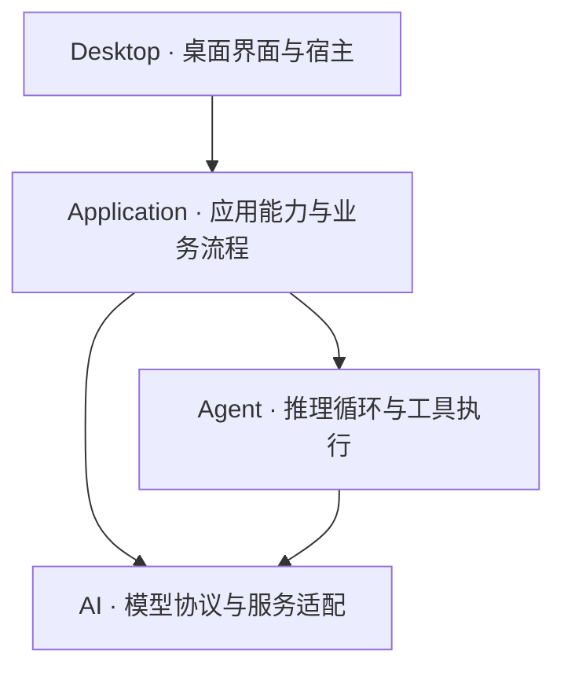

# Megumi

[English](./README.md) | [简体中文](./README.zh-CN.md)

**围绕你的兴趣发现内容，陪你继续探索和行动的桌面 Agent。**

[](#快速开始)
[](https://www.typescriptlang.org/)
[](./LICENSE)

[下载安装](https://github.com/anwen0724/megumi/releases) · [快速开始](#快速开始) · [从源码运行](#从源码运行与构建)

<p align="center">
  <a href="./assets/screenshots/today-discoveries.png">
    
  </a>
</p>

## 为什么做 Megumi

你的兴趣不局限于一个平台。无论是跟进 AI 工程、准备面试，还是研究摄影和烹饪，有用的信息往往散落在视频平台、社区和开放网页中。找到它们需要反复搜索，找到了还要判断哪些值得花时间看。

用自然语言告诉 Megumi 你想了解什么，它会围绕这些兴趣搜寻内容，通过每日动态和精选推荐带到你面前。遇到感兴趣的内容，可以收藏起来，也可以直接开启会话，继续提问、分析，或让 Agent 帮你完成相关任务。

Megumi 是一款面向个人用户的 Windows 桌面应用，支持自选模型服务，会话和应用数据保存在本地。除了内容发现，你也可以通过文字、图片、文档或语音，把它当作日常使用的 Agent 助手。

## 你可以用 Megumi 做什么

- **围绕兴趣发现内容。** 自由描述想了解的主题，随时添加、修改、暂停或删除兴趣，减少在不同平台重复搜索的过程。
- **浏览动态与精选。** 查看近期相关消息，阅读附有理由的精选内容，打开原文或收藏留待回看。
- **从内容继续聊下去。** 将推荐内容带入会话，追问细节、讨论观点，也可以发起独立任务。
- **让 Agent 帮你做事。** 使用网页搜索、文件读写和命令执行等工具，查看执行过程，并通过权限控制决定允许哪些操作。
- **积累可复用的记忆。** 从历史任务整理经验，在后续会话中按需查阅；支持查看与编辑。此能力仍在完善中。
- **用语音交流。** 通过悬浮角色窗口说话，本地语音识别将输入发送到绑定的会话。
- **使用自己的模型。** 选择内置模型服务或添加自定义服务，按需要配置模型与认证方式。图片理解取决于所选模型的能力。

## 内容来源

目前已接入以下内容来源：

| 平台或来源 | 内容与访问方式 |
| --- | --- |
| B 站 | 搜索视频，读取简介及可获取的字幕；部分访问可能需要登录。 |
| 小红书 | 通过内嵌浏览器搜索和读取笔记，需要平台登录会话。 |
| 知乎 | 搜索回答、文章并获取材料，按访问路径配置开放平台凭据或登录会话。 |
| 开放网页 | 使用 Tavily 搜索与提取内容，Bing RSS 提供备用搜索，支持直接读取公开网页。 |

在设置中选择来源，并按需填写凭据或完成登录。内容读取范围受平台限制影响，搜索结果不一定包含完整原文。小红书搜索稳定性仍在完善，知乎登录后的详情读取尚未完成验证。

“跨平台”指内容来自不同平台；桌面应用目前支持 **Windows 10 / 11**。

## 产品体验

**每日动态**帮助你查看近期相关消息，**精选推荐**提供值得进一步阅读的内容；你可以随时调整兴趣和来源，也可以把想保留的内容加入收藏。

以下截图展示兴趣与来源管理，以及从推荐进入会话的使用方式。图片来自已有版本，实际布局以当前版本为准。

<table>
  <tr>
    <td width="50%" align="center"><strong>兴趣管理</strong></td>
    <td width="50%" align="center"><strong>内容来源与设置</strong></td>
  </tr>
  <tr>
    <td><a href="./assets/screenshots/interest-management.png"></a></td>
    <td><a href="./assets/screenshots/discovery-settings.png"></a></td>
  </tr>
</table>

看到值得深入了解的内容，可以带着它开启会话，继续讨论观点、查找资料，或处理具体任务。会话也可以独立使用，不必从推荐开始。

<table>
  <tr>
    <td width="50%" align="center"><strong>从推荐开启会话</strong></td>
    <td width="50%" align="center"><strong>围绕内容继续讨论</strong></td>
  </tr>
  <tr>
    <td><a href="./assets/screenshots/recommendation-conversation-start.png"></a></td>
    <td><a href="./assets/screenshots/recommendation-conversation.png"></a></td>
  </tr>
</table>

## 整体架构

Megumi 使用 Electron、React 和 TypeScript 构建。桌面界面通过应用层接入会话、推荐、记忆和语音等能力；应用层组织业务流程，按任务需要使用 Agent 执行或直接调用模型。


```mermaid
flowchart TD
    Desktop["Desktop · 桌面界面与宿主"] --> Application["Application · 应用能力与业务流程"]
    Application --> Agent["Agent · 推理循环与工具执行"]
    Application --> AI["AI · 模型协议与服务适配"]
    Agent --> AI
```

| 组成 | 负责什么 |
| --- | --- |
| [Desktop](./apps/desktop/) | React 界面、Electron 窗口、IPC，以及浏览器和系统能力接入。 |
| [Application](./packages/application/) | 会话、推荐、记忆、设置、工作区和语音等应用功能，以及数据存储和执行观测。 |
| [Agent](./packages/agent/) | 推理循环、上下文管理、工具与 Skills、权限和沙箱，为不同任务提供执行能力。 |
| [AI](./packages/ai/) | 模型协议、服务适配、认证与流式响应，支持切换模型服务。 |

Agent Harness 为任务执行提供上下文、工具和权限控制；应用层负责具体业务规则。会话与业务状态使用 SQLite 持久保存，长期记忆还使用本地文件。Trace 和日志用于查看模型请求、工具调用及执行中的问题。

## 快速开始

1. 从 [GitHub Releases](https://github.com/anwen0724/megumi/releases) 下载安装程序，或按下方说明从源码运行。
2. 打开设置，配置模型服务、模型与认证方式。
3. 如果要使用内容推荐，配置推荐使用的模型和内容来源，按需填写凭据或登录平台。
4. 在推荐页面打开“管理兴趣与来源”，用自然语言添加兴趣，并确认启用推荐。
5. 浏览“每日动态”和“精选推荐”，或直接新建会话开始交流。首次获取内容需要一些时间；已有结果可以直接回看。

Megumi 持续开发中，安装包包含的功能以对应版本的发布说明为准。

应用数据默认保存在 `~/.megumi`，可通过 `MEGUMI_HOME` 指定其他位置。模型调用与内容搜索会连接你配置的外部服务；本地语音识别在设备上运行。

## 模型支持

支持的 API 协议：

- OpenAI Completions
- OpenAI Responses
- OpenAI Codex Responses
- Anthropic Messages
- Google Generative AI

可以使用内置服务目录，也可以通过受支持的协议、Base URL、Model ID 和认证信息添加自定义服务。

## 仓库结构

```text
apps/desktop/                  Electron 主进程、Preload Bridge 与 React UI
packages/
├── ai/                        模型协议与服务适配
├── agent/                     共用 Agent 执行能力
│   └── src/                   execution、context、tools、resources、permissions、sandbox
└── application/               应用操作、生命周期和业务模块
    ├── src/                   会话、推荐、记忆、设置、工作区、语音、存储与观测
    └── resources/             SQL 迁移、指令、内置技能与语音资源

tests/                         自动化测试与架构守卫
evals/memory/                  记忆评估场景与执行入口
assets/                        截图与公开资源
```

## 从源码运行与构建

环境要求：Windows 10/11、Node.js 24、npm 和 Git。

安装依赖并启动开发环境：

```bash
npm ci
npm start
```

运行类型检查与测试：

```bash
npm run typecheck:packages
npm run typecheck:product
npm test
```

构建应用目录或 Windows 安装程序：

```bash
npm run package
npm run make
```

构建产物位于 `out/desktop/`。启动、构建与测试命令会为对应运行环境准备原生 SQLite 依赖。

## 致谢

Megumi 的模型服务层基于 [`pi` 的 AI 包](https://github.com/earendil-works/pi)，并针对项目使用场景进行了适配。

## 许可证

Megumi 使用 [MIT 许可证](./LICENSE)。
